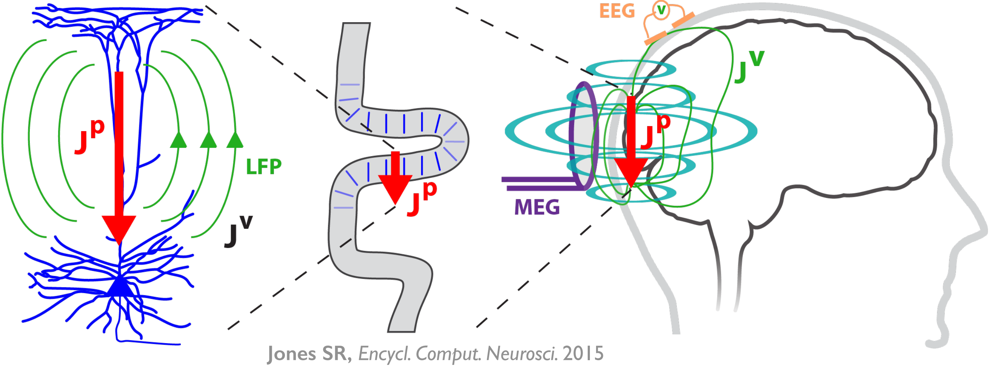
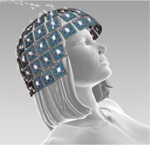
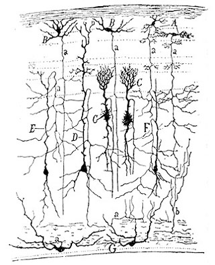

Background
===============================

Macroscale human brain imaging signals
--------------------------------------
Magneto-encephalography (MEG) and electro-encelphalography (EEG)
are the leading methods to non-invasively record human neural dynamics with millisecond
temporal resolution. However, it is extremely difficult to infer the underlying cellular and
circuit level origins of these "macro-scale" signals without simultaneous invasive recordings.
This limits the translation of MEG/EEG findings into novel principles of information
processing, or into new treatment modalities for neural pathologies. There is a pressing
need, and a unique opportunity, to relate the "macro-scale" signals to their underlying
circuit/cellular-level generators.

	**Primary current sources (Jp) from intracellular currents in cortical pyramidal neuron dendrites contribute
	to the detected MEG/EEG signals** The intracellular longitudinal current flow in large populations of
	synchronously activated pyramidal neurons, aligned in parallel and tangential to MEG sensors outside of the
	head, create a net primary current dipole (*e.g.*, red arrows) large enough to be
	measured. Depending on the orientation and magnitude of the current sources, the signals will either be
	measurable only by MEG or also by EEG.

Linking noninvasive human brain imaging signals to cell/circuit level electrophysiology
---------------------------------------------------------------------------------------

.. |modeqfig| image:: images/modeq.png
        :scale: 40%
	:align: bottom

+-------------------+----------------+---------------+
| |megeegschemefig| | |modeqfig|     | |cortcolfig|  |
|                   |                |               |
| MEG/EEG signals   | Biophysical    | Cell,circuit  |
| provide           | models link    | generators of |
| multivariate      | data to cell,  | neocortical   |
| time-series.      | circuit level. | dynamics.     |
+-------------------+----------------+---------------+

