Tour of the Graphical User Interface (GUI)
==========================================

Here we provide an overview of the major GUI
components, and provide a description of all
the parameters that the GUI provides.

This is a display of the GUI after running
a simulation that produces ongoing alpha/beta rhythms.

.. image:: images/starthnndefaultrun.png
	:scale: 30%	
	:align: center

The top contains a standard menu and buttons for setting parameters,
running simulations, and viewing the simulation/experimental data output. 
Under the simulation output there are several schematics to provide
intuition on the model's structure, and are described below. 

Preliminaries: Parameter Files
------------------------------

Before delving into the details of the GUI, we first provide an overview of the
parameter files used by HNN. Parameter files are text-based and contain all the
key parameters needed to run a model. These parameters include synaptic inputs,
neuronal biophysics, and local network connectivity. HNN reads/writes these parameter
files so you don't have to edit them yourself.

In order to facilitate effective modeling, we have provided a set of text-based parameter files
that allow you to replicate event related
potentials (ERPs), and alpha/beta/gamma rhythms. HNN can load the parameter files, allowing 
you to replicate the dynamics, see the critical parameter values that are responsible for
the observed dynamics, and then modify the parameter files/values to observe the effect on 
dynamics. Parameter files are stored in the param subdirectory and can be viewed in any
text editor. To load these parameter files into HNN, press the ``Set Parameters from File`` button,
select the parameter file, and press enter. HNN will parse the file and display the values
in the GUI. Then, running the simulation will use these parameter values. 

Setting Parameters 
----------------------

To view and set the parameters that control the simulation, press the ``Set Parameters`` button from the
main GUI window. This will bring up the following dialog:

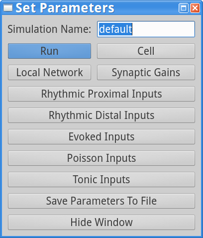

Pressing each button on this dialog brings up a new dialog box with more adjustable
parameters. We will go through each below.

The next thing to note is the ``Simulation Name``. This should be a unique identifier
for any particular simulation you run. HNN also uses this variable to determine where
to save the output files. In the dialog displayed, note that the value is set to ``default``.
This is because the ``default.param`` file was loaded. We suggest you change this name
when you make changes to the parameters and before you run a new simulation.

Here is an example of the data directory and files saved after running the simulation
specified in ``default.param``.

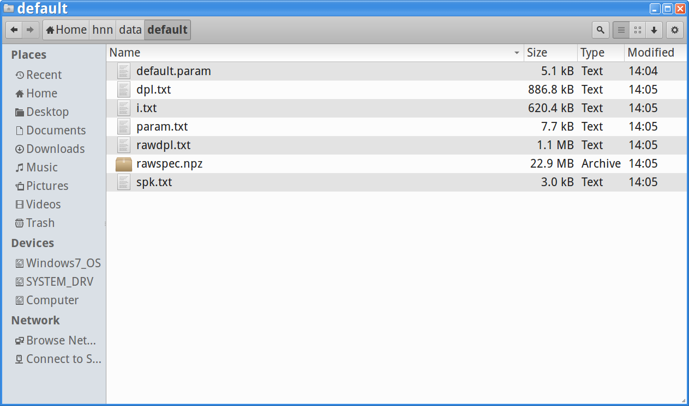

Note that the directory path is ``/home/hnn/data/default``, corresponding to the ``default``
``Simulation Name`` parameter specified in the GUI. Also note the individual files present in the window: 

 #. default.param - a backup copy of the param file used to run the simulation
 #. dpl.txt - normalized dipole in units of nAm; 1st column is time; 2nd column is layer 2 dipole; 3rd column is layer 5 dipole; 45h column is aggregate dipole from layers 2 and 5
 #. i.txt - currents from the cells
 #. param.txt - a machine-readable representation of all parameters used to run the simulation
 #. rawdpl.txt - un-normalized dipole; same columnar layout as dpl.txt
 #. rawspec.npz - spectrogram from the dipole saved in numpy format; you can use numpy to load this file
 #. spk.txt - a list of cell identifiers and spike times

We provide these files for advanced users who want to load them into their own analysis
software, and also to allow HNN to load data after a simulation was run. For example, if you
close HNN and then restart it, load a param file from a simulation that was already run, 
HNN will load and display the data. 

Run Parameters
^^^^^^^^^^^^^^

Pressing the ``Run`` button on the ``Set Parameters`` dialog box brings up the
following dialog, enabling you to view/change the following displayed parameters.

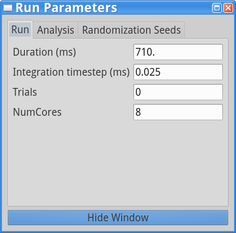

* Duration (ms) - this sets the simulation duration in milliseconds.
* Integration timestep (ms) - this sets the fixed timestep that the NEURON simulator uses to perform integration; smaller values take longer to run but potentially offer more accurate simulations; we recommend using the default value of 0.025 ms.
* Trials - specifies the number of trials to run; note that the simulation parameters across trials are identical except for inputs which are randomized across trials. 
* NumCores - this specifies the number of cores that NEURON will use to run a simulation in parallel; we suggest using the default, which HNN automatically determines based on your computer hardware. 

Clicking on the ``Analysis`` tab brings up the following parameters.

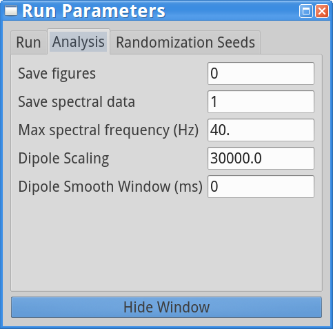

* Save figures - whether to save figures of model activity when the simulation is run; if set to 1, figures are saved in simulation output directory.
* Save spectral data - Whether to save spectral simulation spectral data - time/frequency/power; if set to 1, saved to simulation output directory. **Note: when using rhythmic inputs, spectrograms will be saved whether or not this is set to 1.**
* Max spectral frequency (Hz) - Maximum frequency used in dipole spectral analysis.
* Dipole scaling - Scaling used to match simulation dipole signal to data; implicitly estimates number of cells contributing to dipole signal.
* Dipole Smooth Window (ms) - Window size (ms) used for Hamming filtering of dipole signal (0 means no smoothing); for analysis of ongoing rhythms (alpha/beta/gamma), best to avoid smoothing, while for evoked responses, best to smooth with 15-30 ms window.

Clicking on the Randomization Seeds tab brings up the following parameters.

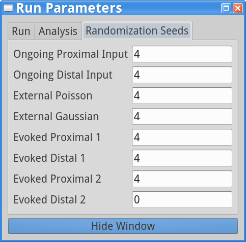

All these paramters are random number generator seeds for the different types of *inputs* provided
to the model. Varying a seed will still maintain statistically identical inputs but allow for controlled variability.

* Random number generator seed used for rhythmic proximal inputs.
* Random number generator seed used for rhythmic distal inputs.
* Random number generator seed used for Poisson inputs.
* Random number generator seed used for Gaussian inputs.
* Random number generator seed used for evoked proximal input 1.
* Random number generator seed used for evoked distal input 1. 
* Random number generator seed used for evoked proximal input 2.
* Random number generator seed used for evoked distal input 2.

Cell Parameters
^^^^^^^^^^^^^^^

Pressing the ``Cell`` button on the ``Set Parameters`` dialog box brings up the
following dialog, enabling you to view/change the cell parameters
associated with geometry, synapses, and biophysics for layer 2 and layer 5
pyramidal neurons.

These parameters control the cell's geometry:

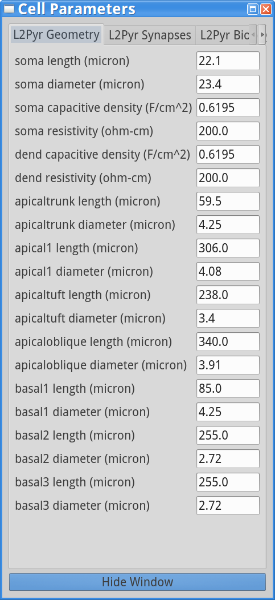

and include lengths/diameters of individual compartments. Although not
strictly related, we have also included axial resistivity and capacitive
in this panel. 

Clicking on the Synapses tab allows you to modify the postsynaptic
properties of layer 2 pyramidal neurons:

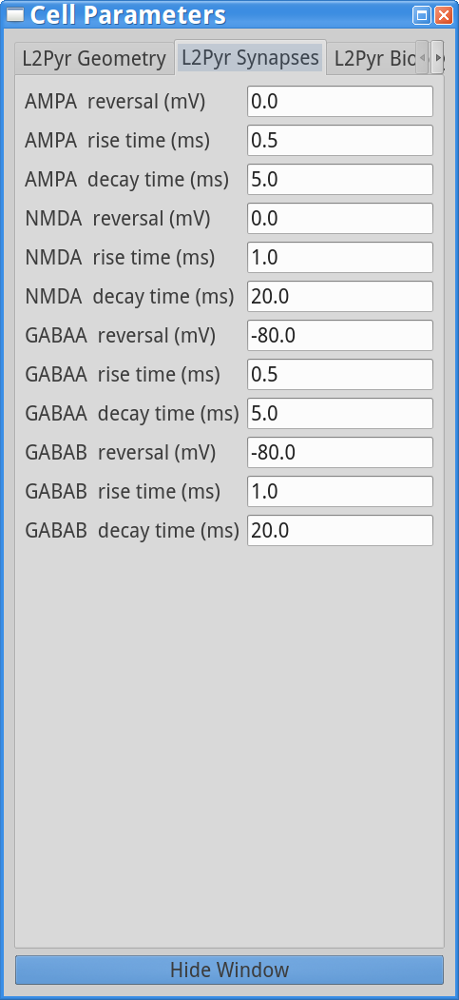

These include the excitatory (AMPA/NMDA) and inhibitory (GABAA/GABAB)
reversal potentials and rise/decay exponential time-constants.

Clicking on the L2Pyr Biophysics tab allows you to modify the biophysical
properties of layer 2 pyramidal neurons, including ion channel densities
and reversal potentials:

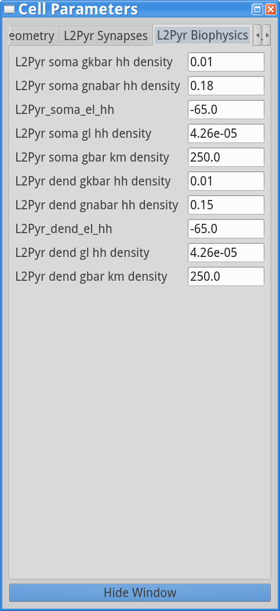

To modify properties of the layer 5 pyramidal neurons, click on the right
arrow to access the relevant tabs (beginning with L5Pyr).

Local Network Parameters
^^^^^^^^^^^^^^^^^^^^^^^^

Neurons in the model are arranged in three dimensions. The *XY* plane
is used to array cells on a regular grid while the Z-axis specifies
cortical layer. 

.. figure:: images/net_3D.png
        :scale: 20%
	:align: center
    
This 3D visualization of the model is rotated to allow easier viewing.
The top and bottom represent supra- and infragranular cortical layers. 
In this figure, the following color code is used for the different cell types
in the model-- red: layer 5 pyramidal neurons; green: layer 2 pyramidal
neurons; white: layer 2 interneurons; blue: layer 5 interneurons. 

.. figure:: ../res/connfig.png 
        :scale: 60%           
	:align: center
	
This figure shows a schematic of network connectivity. The blue cells are pyramidal
cells, while the orange circles represent the interneurons. The lines between neurons
represent local synaptic connections. Lines ending with a circle are excitatory 
(AMPA/NMDA) synapses, while lines ending with a line are inhibitory (GABAA/GABAB)
synapses.	

Pressing the ``Local Network`` button on the ``Set Parameters`` dialog box brings up the
following dialog, enabling you to view/change the local network microcircuit parameters
including number of cells and synaptic weights between cells of specific types.

These parameters control the number of pyramidal cells in the *X* and *Y* directions
per cortical layer:

.. image:: images/localnetparamdlg.png
        :scale: 40%
	:align: center	

Note that the pyramidal cells are arranged in the *XY* plane, so the number of cells
in a layer is the product of the number along the X and Y directions. The number of interneurons
per layer is adjusted to be 

To adjust synaptic weights onto a particular cell type, click the corresponding tab
in the dialog. For example, the following dialog alllows viewing/setting the synaptic
weights onto layer 2 pyramidal neurons:

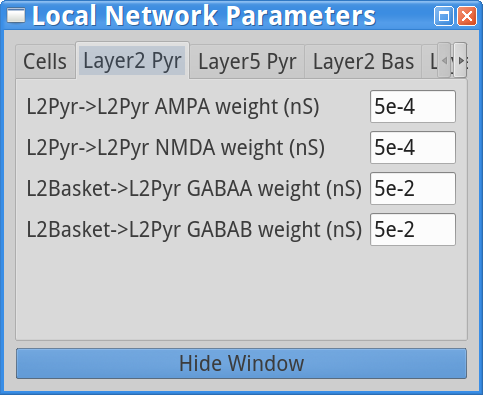

In this example, AMPA/NMDA weight are the excitatory synaptic weights, while GABAA/GABAB are the
inhibitory synaptic weights. All weights are specified in units of conductance (nS). Note that
the synaptic weight, :math:`w`, between two cells is scaled by the distance between
the two cells through the 
following equation:  :math:`w \cdot e^-(d^2/\lambda^2)` , where :math:`w` is the weight
specified in the dialog,
:math:`d` is the distance between the cells in the *XY* plane, and :math:`\lambda` is a spatial length
constant which is 3 or 20 :math:`\mu m` when a presynaptic cell is excitatory or inhibitory, respectively,
in order to have shorter spread of excitation relative to inhibition.

.. where is lambda set? 3,20 for all?
.. (/u/samn/hnn/L2_basket.py:78)
.. (/u/samn/hnn/cell.py:241)

Excitatory (E) and inhibitory (I) *tone* within the network is a major factor influencing
network dynamics. The following dialog, accessible with the ``Synaptic Gains`` button from the
main ``Set Parameters`` dialog, facilitates scaling of E->E, E->I, I->E, and I->I
weights, without having to adjust the weights between specific types of cells.

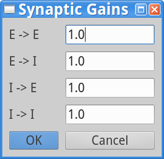

In this dialog changing the ``1.0`` to other values and pressing ``OK`` will multiply the appropriate
weights displayed in the ``Local Network Parameter`` dialog. For example, setting ``E->E`` to
a value of ``2.0`` will double the weights between all pairs of excitatory cells. Changing a value
and then pressing ``Cancel`` will produce no effect.

Synaptic Inputs - *Proximal* vs *Distal*
^^^^^^^^^^^^^^^^^^^^^^^^^^^^^^^^^^^^^^^^

For both rhythmic and evoked synaptic inputs (described below) we use the terms
*proximal* and *distal* to refer both to the origin of the inputs as well as the 
laminar target within the neocortical microcircuit. Proximal inputs refers to inputs
arriving from lemniscal thalamus, which primarily target the granular
and infragranular layers while distal inputs arrive from non-lemniscal thalamus
and cortico-cortical feedback, which primarily target the supragranular layers. These
differences are illustrated in schematics in several places in the HNN GUI, and also shown here.

.. |proxfig| image:: ../res/proxfig.png
        :scale: 50%
	:align: bottom

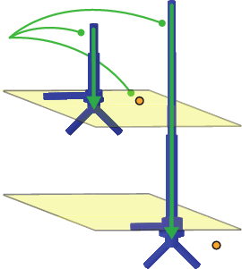

+-----------+------------+
| |proxfig| | |distfig|  |
+-----------+------------+

The left schematic here shows proximal inputs which target basal dendrites
of layer 2 and layer 5 pyramidal neurons, and somata of layer 2 and layer 5 interneurons.
The red arrows indicate that these proximal inputs *push* the current flow up the dendrites
towards supragranular layers.
The right schematic shows distal inputs which target the distal apical dendrites
of layer 5 and layer 2 pyramidal neurons and the somata of layer 2 interneurons.
The green arrows indicate that these distal inputs *push* the current flow down
towards the infragranular layers.

Rhythmic Inputs (Synaptic)
^^^^^^^^^^^^^^^^^^^^^^^^^^

You can provide rhythmic inputs throughout a simulation, or for a fixed interval
within the simulation using the ``Rhythmic Proximal Inputs`` and ``Rhythmic Distal Inputs``
dialogs available from the main ``Set Parameters`` dialog window. 

.. |rhythproxparamfig| image:: images/rhythproxparamdlg.png
        :scale: 40%
	:align: bottom

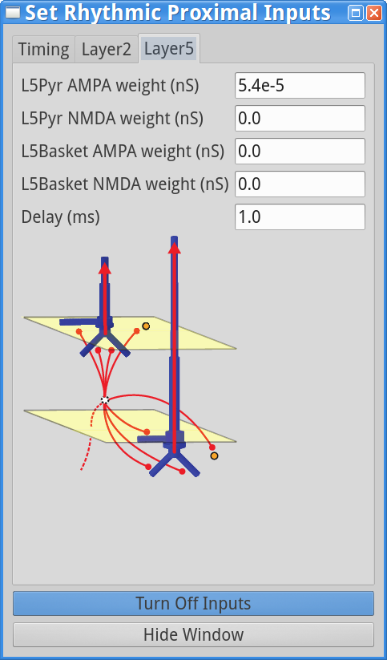

+---------------------+------------------------+-----------------------+
| |rhythproxparamfig| | |rhythproxL2paramfig|  | |rhythproxL5paramfig| |
+---------------------+------------------------+-----------------------+

.. |rhythdistparamfig| image:: images/rhythdistparamdlg.png
        :scale: 40%
	:align: bottom

.. |rhythdistL2paramfig| image:: images/rhythdist_L2paramdlg.png
        :scale: 40%
	:align: bottom

.. |rhythdistL5paramfig| image:: images/rhythdist_L5paramdlg.png
        :scale: 40%
	:align: bottom

+---------------------+------------------------+-----------------------+
| |rhythdistparamfig| | |rhythdistL2paramfig|  | |rhythdistL5paramfig| |
+---------------------+------------------------+-----------------------+

Rhythmic inputs are selected using an average frequency with variability. The resulting 
synaptic events can be repeated multiple times to create further variability and more inputs.
Each *repeat* selects a set of events from a distribution with average starting time, interval (frequency), 
and appropriate ending time. Each input is sent to the synapses of the appropriate compartments (basal
vs apical dendrites, etc.) of the appropriate neurons. 

As mentioned above, proximal and distal inputs target different cortical layers. However, you can set
their start/stop times and frequencies using the same specification. This is shown in the left-most panels above:

 * Distribution - specifies the distribution used to set the individual synaptic input events -- currently only normal distributions are supported
 * Start time mean (ms) - specifies the avarage start time for rhythmic inputs
 * Start time stdev (ms) - specifies the standard deviation of start times for rhythmic inputs
 * Stop time (ms) - specifies when the rhythmic inputs should be turned off
 * Frequency mean (Hz) - average frequency of rhythmic input
 * Frequency stdev (Hz) - standard deviation of rhythmic input frequency
 * Events/cycle - must be set to 1 or 2; provides *n* events at each selected time
 * Repeats - how many times should the full event sequence get repeated (each repeat adds variability and more inputs)

The middle and right panels above allow you to set the weights of the rhythmic synaptic inputs units of conductance)
and add delays (ms) before the cells receive the events to layers 2 and 5, respectively. Note that the
``Turn Off Inputs`` button shown on the two dialogs above is a shorthand, allowing you to set the weights
of rhythmic or proximal synaptic inputs to 0.0, effectively shutting them off.

Evoked Inputs (Synaptic)
^^^^^^^^^^^^^^^^^^^^^^^^

Evoked inputs are used to model event related potentials (ERPs) and are typically
set to produce neuronal spiking. To set Evoked Input parameters, press the ``Evoked Inputs``
button on the main ``Set Parameters`` dialog window. Evoked Inputs use the proximal/distal
notation mentioned above. You will be able to set an arbitrary number of evoked inputs using
the ``Add Proximal Input`` and ``Add Distal Input`` button shown. 

.. |evokedparamdlgfig| image:: images/evokedparamdlg.png
        :scale: 40%
	:align: bottom

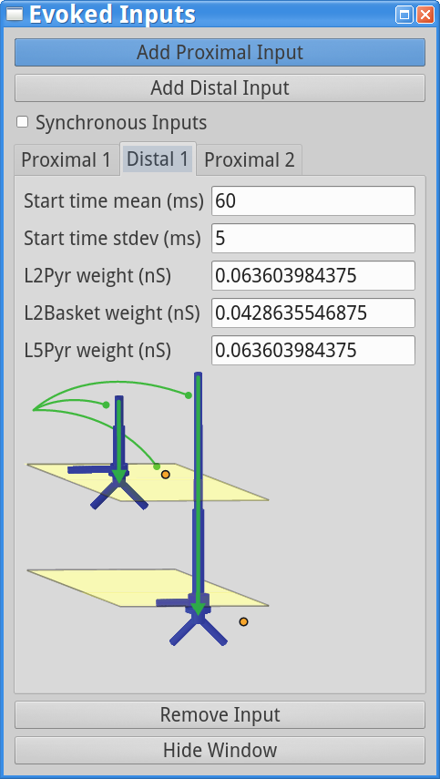

+---------------------+--------------------------+
| |evokedparamdlgfig| | |evokeddist_paramdlgfig| |
+---------------------+--------------------------+

Proximal and distal inputs are numbered sequentially. In the example shown,
there are 2 Proximal and 1 Distal inputs. The following parameter values are
used:

 * Start time mean (ms) - average start time
 * Start time stdev (ms) - standard deviation of start time
 * L2Pyr weight (nS) - weight of synaptic inputs to layer 2 pyramidal neurons
 * L2Basket weight (nS) - weight of synaptic inputs to layer 2 basket cells
 * L5Pyr weight (nS) - weight of synaptic inputs to layer 5 pyramidal neurons
 * L5Basket weight (nS) - weight of synaptic inputs to layer 5 basket cells (only used for *proximal* inputs)

``Synchronous Inputs`` indicates whether for a specific evoked proximal/distal input each neuron receives
the input at the same time, or if instead each neuron receives the evoked input events independently drawn from
the same distribution. To remove the input shown in the currently active tab, press the ``Remove Input`` button.

Poisson Inputs (Synaptic)
^^^^^^^^^^^^^^^^^^^^^^^^^

Poisson Inputs, are excitatory AMPAergic synaptic inputs to the somata of different
neurons, which follow a Poisson Process. The parameters to control them are accessed
via the dialog brought up when pressing the ``Poisson Inputs`` button on the main
``Set Parameters`` dialog window.

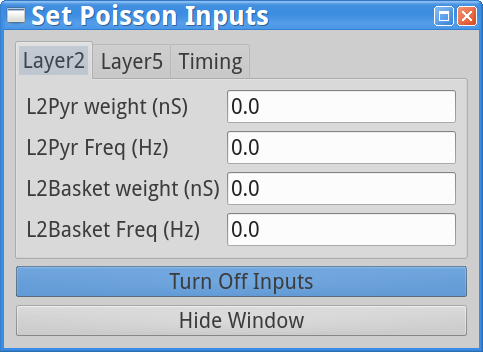

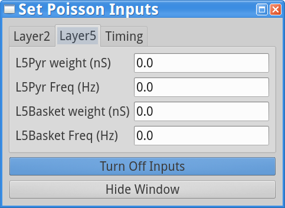

.. |poisson_timingparamdlgfig| image:: images/poisson_timingparamdlg.png
        :scale: 40%
	:align: bottom

+----------------------+-------------------------+-----------------------------+
| |poissonparamdlgfig| | |poisson_L5paramdlgfig| | |poisson_timingparamdlgfig| |
+----------------------+-------------------------+-----------------------------+

As shown above, the Poisson synaptic input frequency and weight are set individually
for each type of neuron. The timing tab of the dialog allows you to set the start
and stop time of Poisson-generated events. **Note: a Stop time of -1 means that
events are generated until the end of the simulation.**

Tonic Inputs (Current Clamp)
^^^^^^^^^^^^^^^^^^^^^^^^^^^^

*Tonic* inputs are modeled as somatic current clamps with a fixed current injection.
These clamps can be used to adjust the resting membrane potential of a neuron, and bring
it closer (with positive amplitude injection) or further from firing threshold (with
a negative amplitude injection). 

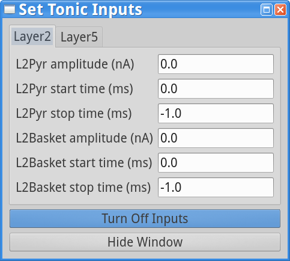

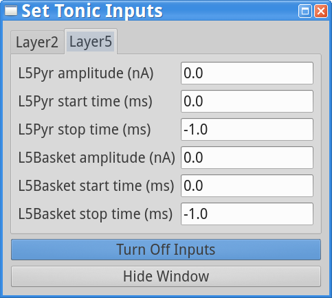

+----------------------+-------------------------+
| |tonicparamdlgfig|   | |tonic_L5paramdlgfig|   |
+----------------------+-------------------------+

As shown above, you can set the current clamp amplitude, and start/stop time
for each neuron type. **Note: Stop time of -1 means that the clamp is applied
until the end of the simulation.**

