How to Simulate:
================

Here we demonstrate how to use the HNN software to simulate
several patterns of interest: 

 1. Event Related Potentials (ERPs)
 2. Alpha/Beta Rhythms
 3. Gamma Rhythms

We take you step-by-step through the parameter settings required
to replicate the dynamics, and ahow you how to compare experimental
data to the model output. We also provide the parameter (.param) files
which contain parameter values to generate the dynamics. This way, you
can load the parameter files and run the model with *correct* parameter
values, without having to enter all the values manually.

Event Related Potentials (ERPs)
-------------------------------

We begin with running simulations of ERPs. ERPs are detectable
in EEG/MEG recordings from sensory brain areas in response to
sensory events. For example, when a tactile stimulus is applied
to the hand, after a delay, an ERP can be detected in somatosensory
cortex. ERPs have prototypical waveforms. However, the mechanisms
that lead to ERPs are not fully known. Previous modeling has demonstrated
that the timing and strength of inputs arriving into different cortical
layers is responsible for generating the events. 

.. figure:: images/MEG_pub_model_comp.png
	:scale: 20%	
	:align: center

	**Comparison of ERP in experiment and simulation.** Left: MEG experiment showing
	ERP in response to tactile stimulation.
	Red: suprathreshold/detected trials; Blue: Threshold detected trials.
	Right: Simulation showing proximal/distal inputs needed to replicate the
	ERP waveform from MEG experiment. Note *scaling factor* which multiplies the dipole
	signal generated by the model to match to the MEG ERP data, and used to predict the number
	of neurons contributing to an ERP.

We will use HNN to
generate ERP waveforms which have close similarity with ERPs from
primary somatosensory cortex (S1) *in vivo* MEG experiments. These
experiments were previously published (refs), and involve tactile
stimulation. The data is split into two conditions: yes (detected)
and no (non-detected) trials. As we will see, the ERP waveforms
differ noticeably.

Load/view parameters
^^^^^^^^^^^^^^^^^^^^

To run the simulations yourself, first download the param file
here: - `ERPYes100Trials.param <../../param/ERPYes100Trials.param>`_
Then load the parameter file values by clicking ``Set Parameters From File``
and selecting the file you just downloaded.

To view the parameters, click on ``Set Paramters``, and then ``Evoked Inputs``.
You should see the values displayed in the dialogs below.

.. |erpprox1fig| image:: images/ERPYesProx1param.png
        :scale: 40%
	:align: bottom

.. |erpdist1fig| image:: images/ERPYesDist1param.png
        :scale: 40%
	:align: bottom

.. |erpprox2fig| image:: images/ERPYesProx2param.png
        :scale: 40%
	:align: bottom

+---------------+---------------+---------------+
| |erpprox1fig| | |erpdist1fig| | |erpprox2fig| |
+---------------+---------------+---------------+

These parameters were set so as to grossly match the model ERP waveforms
to those seen in the MEG data.

Running the simulation will produce the output shown below. The thin gray
traces are dipole signals from individual trials while the thick black
trace is the average ERP. 

.. figure:: images/ERPYes100Compare.png
	:scale: 40%	
	:align: center

	If you had run the model with these settings and 100 trials you would see the output below. 
	In addition, this figure shows comparison to the MEG data and the root-mean-squared-error
	comparison. Note the close similarity of model and experimental data. Below, we will describe
	how to load the MEG data provided with HNN.

Running the simulation
^^^^^^^^^^^^^^^^^^^^^^

Next, we will change the ``simulation name``, and reduce the number of trials so that you can run the model
on your laptop. Enter a new *descriptive* name for the simulation here, for example *ERPYes2Trials*:

.. figure:: images/ERPYessetparam.png
	:scale: 40%	
	:align: center

Now press the ``Run`` button on the ``Set Parameters`` dialog box to change the number of trials from 100 to 2:

.. figure:: images/ERPYesrunparam.png
	:scale: 40%	
	:align: center

**Note: NumCores is the number of cores to parallelize the model, is automatically detected by HNN
and may differ, depending on your hardware.**

Next, press the ``Start Simulation`` button from the main GUI window. This will start the simulation,
and should take 1-2 minutes, depending on your hardware. 

.. figure:: images/ERPYes2Output.png
	:scale: 40%	
	:align: center

	Drawing on white canvas shows the model output after running 2 trials. The top two panels show the histogram
	of input times with distal evoked inputs in green (*evdist*) and proximal evoked inputs in red (*evprox*).
	The bottom panel shows the dipole signals. The gray traces are from individual trials while the black trace
	is the average across trials. The red and green arrows indicate the times and directions of current flow
	within the pyramidal neurons produced by proximal and distal evoked inputs, respectively. Note that the y-axis
	scales the simulated dipole by 3000.0, implicitly predicting the number of cells that contribute to the
	signal (here 600,000 cells; consistent with experimental data).

A closer look at simulation output
^^^^^^^^^^^^^^^^^^^^^^^^^^^^^^^^^^

Next, we can examine the simulation data more closely. 

First, let's look at the dipole signal contributions from individual layers. From the main GUI window,
click on the ``View menu`` -> ``View Simulation Dipoles``. You should see the following window.

.. figure:: images/ERPYes2ViewDipoles.png
	:scale: 40%	
	:align: center

	This window shows the dipole contributions from Layer2 (top), Layer5 (middle), and the
	aggregate (bottom). Note the different features in Layer2 vs Layer5 dipole signals, allowing
	you to tease apart how the different cortical layers contribute to different waveform features.
	In this figure the gray traces are from individual trials and the white trace
	is the average across trials. The same dipole scaling factor is used (3000.0). The bottom
	drop-down menu which currently has ``Show All Trials`` selected allows you to change the
	view to show the dipole signals from an individual trial. You can also save the image using
	the standard ``matplotlib`` menu at the top. 

Next, let's examine the spiking generated by neurons in the network. From the main GUI window,
click on the ``View menu`` -> ``View Simulation Spiking Activity``. You should see the
following window.

.. figure:: images/ERPYes2ViewSpiking.png
	:scale: 40%	
	:align: center

	This window shows the spiking activity produced by the model in response to the evoked
	inputs. The top and middle panels show histograms of distal evoked inputs (green) and
	proximal evoked inputs (red) provided to the neurons. The bottom panel shows a raster
	plot of the spiking activity generated by the neurons (x-axis: time in ms; y-axis neuron
	identifier). The neuron identifiers are arranged vertically by layer, with top
	representing supragranular layers and the bottom representing the infragranular layers.
	Individual neuron types are drawn in the different colors shown in the legend. The dotted
	lines show a time-series of summed activity, per population (same color code as the
	individual spikes). The initial view shows the aggregate spiking activity across trials. To
	see spiking activity generated by a single trial select the trial number using the combination
	box at the bottom of the window. This window also provides the standard save/navigation functionality
	through the ``matplotlib`` control at the top.

Comparing to MEG ERP data
^^^^^^^^^^^^^^^^^^^^^^^^^

Now that we have run the simulation we can compare how well its ERP waveform fits the ERP
seen in the MEG experiments. We have provided data from the Jones 2007 (ref) paper in a format
that HNN can read (described here). To load the data go to ``File menu`` -> ``Load data file``
and select ``data/MEG_detection_data/yes_trial_S1_ERP_all_avg.txt`` (``data`` is a subdirectory
under the main hnn install location). HNN will then load the data and display the waveform
in the dipole window as shown below.

.. figure:: images/ERPYes2Compare.png
	:scale: 40%	
	:align: center

	This figure shows a comparison of mode land MEG ERP waveforms for the ``yes/detected`` condition.
	The MEG ERP is drawn in the yellow dotted-line, while the average simulation ERP waveform is drawn
	in black. HNN also calculates the root-mean-squared-error (RMSE) between the average simulation ERP
	waveform and the waveform loaded from the .txt file. As seen in the figure, the RMSE is 10.19. Above,
	when we ran more trials, the ERP was considerably lower - at 5.15. If you run more trials with the same
	parameters you should be able to reduce the RMSE.

Adjust Evoked Inputs
^^^^^^^^^^^^^^^^^^^^

Now let's practice adjusting the evoked input parameters. We can tell HNN to provide synchronous evoked inputs
to all the neurons. This will reduce variability in timing of evoked inputs producing a stronger response. 
*Question: will this also improve goodness-of-fit to the MEG data?*

All we'll do now is set the evoked inputs to *synchronous* -- so that all relevant neurons get the proximal/distal
inputs at the same time. First change the ``simulation name`` to *e.g.* ERPYes2TrialsSync in the main
``Set Parameters`` window. If you don't still have the ``Evoked Inputs`` dialog window open, click 
the ``Evoked Inputs`` button in the ``Set Parameters`` window. Then, make sure the box with
``Synchronous Inputs`` is checked. Then press ``Start Simulation``.

.. figure:: images/ERPYes2SyncCheck.png
	:scale: 40%	
	:align: center
	
After the simulation has completed you'll see the following output. Although the model 
replicates gross features of the MEG data, the fit to the
is now substantially worse (RMSE of 23.31). Also note that there is much lower
variability of the input times in the green/red histograms at the top of the output canvas.

.. figure:: images/ERPYes2SyncOutput.png
	:scale: 40%	
	:align: center

If you're adventurous and have some time, try running the same parameters with 100
trials. That will reduce the RMSE, producing output similar to that shown here.

.. figure:: images/ERPYes100SyncOutput.png
	:scale: 40%	
	:align: center

	Output from 100 trials with *synchronous* evoked inputs. Note that the fit to
	the MEG data is now improved (RMSE of 13.7).

Next, we'll look at the MEG data from *no/non-detected* trials. We'll look at how
to adjust the evoked input parameters to better match this model. First, let's clear
the MEG data from the detected trials. To do this, go to ``File menu`` -> ``Clear data file``
from the main GUI window. Next, load the data from the non-detected trials. Go to
``File menu`` -> ``Load data file`` and select ``data/MEG_detection_data/no_trial_S1_ERP_all_avg.txt``.
HNN will recalculate the model fit to the data, showing a poor fit (RMSE of 32.19). 

.. figure:: images/ERPYes100SyncCompareToNo.png
	:scale: 40%	
	:align: center

	Model run with 100 trials using yes/detected parameters has poor fit to the MEG data from the
	no/non-detected trials. 

Next, we'll load the
.param file with parameter values to match this MEG data.  First download the param file
here: - `ERPNo100Trials.param <../../param/ERPNo100Trials.param>`_
Then load the parameter file values by clicking ``Set Parameters From File``
and selecting the file you just downloaded. To view the new parameters,
click on ``Set Paramters``, and then ``Evoked Inputs``.
You should see the values displayed in the dialogs below.

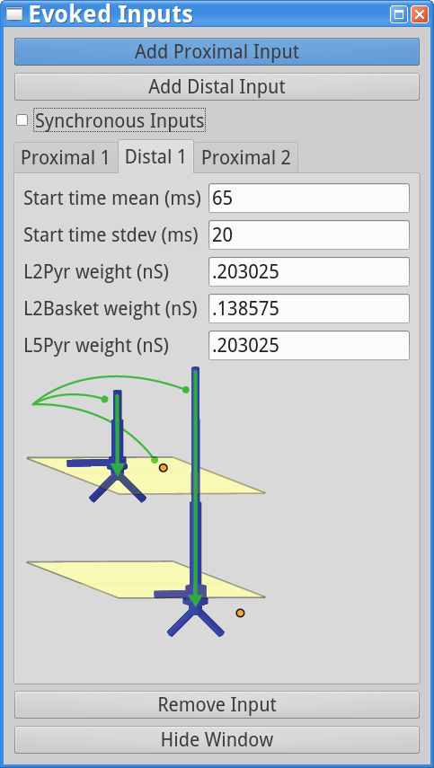

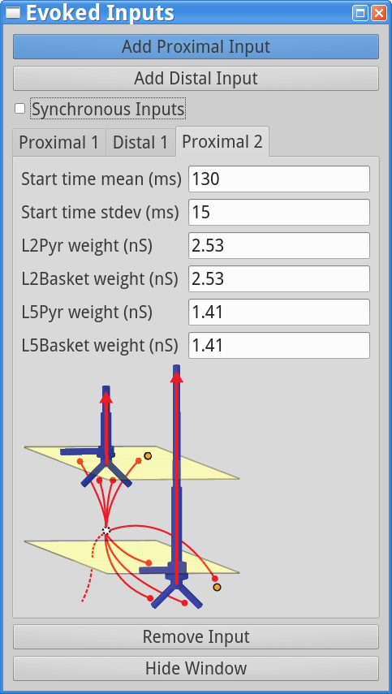

+-----------------+-----------------+-----------------+
| |erpnoprox1fig| | |erpnodist1fig| | |erpnoprox2fig| |
+-----------------+-----------------+-----------------+

Notice that the weights of these evoked inputs for these non-detected
trials are smaller than the weights for the detected trials. The timing
also differs.

Next, let's reduce the number of trials to 2 (from the ``Run`` dialog),
change the ``simulation name`` (from the ``Set Parameters`` dialog), and see how well
the data fits after running the simulation (with the ``Start Simulation`` button
on the main GUI.

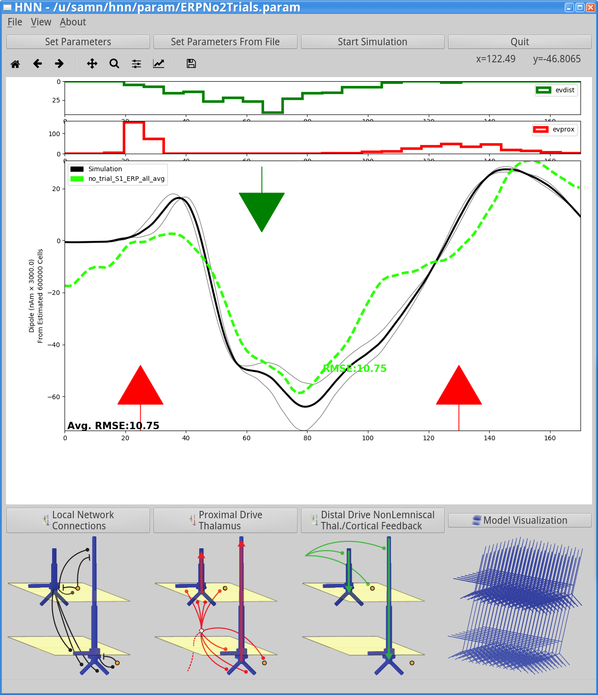

	Output after running 2 trials of the model with the non-detected parameters.
	Note that the distal inputs are highly dispersed in time. There is a good fit
	to the experimental data (RMSE of 10.75). As an exercise you may want to run
	100 trials and/or see if you can reduce the RMSE further. 
	

Alpha/Beta Rhythms
------------------

In this part of the tutorial we will look at how to use HNN to simulate low-frequency
alpha (~10 Hz) and beta (~20 Hz) rhythmic activity. A look at ongoing MEG signals
shows that alpha/beta complexes emerge for brief periods. We will use the model
to replicate some of these features.

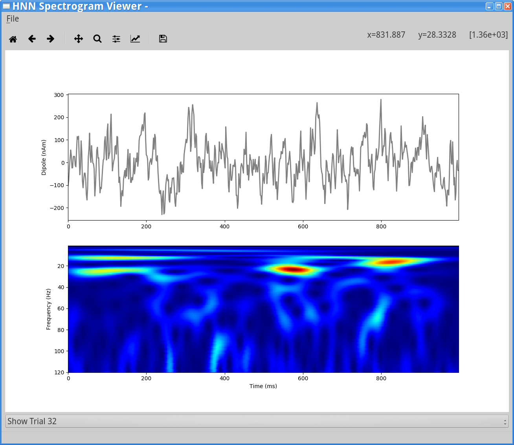

	Ongoing MEG activity (top) along with wavelet spectrogram (bottom) shows
	that alpha/beta complexes emerge briefly. This data is viewed in HNN's
	spectrogram viewer (described in the Viewing Data section). Note that in this
	data the MEG signal goes both above and below 0, an important constraint
	for any model to replicate.

Only Rhythmic Proximal Inputs
^^^^^^^^^^^^^^^^^^^^^^^^^^^^^

What are the inputs required to generate alpha and/or beta rhythms? To start we 
can add rhythmic proximal inputs at an alpha frequency. Download the relevant param file
here: - `OnlyRhythmicProx.param <../../param/OnlyRhythmicProx.param>`_
Then load the parameter file values by clicking ``Set Parameters From File``
and selecting the file you just downloaded. To view the new parameters,
click on ``Set Paramters``, and then ``Rhythmic Proximal Inputs``.
You should see the values displayed in the dialogs below.

.. |rhythproxonlytimingparamfig| image:: images/OnlyRhythmicProxTimingparam.png
        :scale: 40%
	:align: bottom

.. |rhythproxonlyl2paramfig| image:: images/OnlyRhythmicProxL2param.png
        :scale: 40%
	:align: bottom

.. |rhythproxonlyl5paramfig| image:: images/OnlyRhythmicProxL5param.png
        :scale: 40%
	:align: bottom

+-------------------------------+---------------------------+---------------------------+
| |rhythproxonlytimingparamfig| | |rhythproxonlyl2paramfig| | |rhythproxonlyl5paramfig| |
+-------------------------------+---------------------------+---------------------------+

Next, click on ``Start Simulation`` from the main GUI window. This simulation
runs for 700 ms of simulation time, so will take a little longer to run than
the ERP simulations. Once completed, you will see output similar to that shown below.

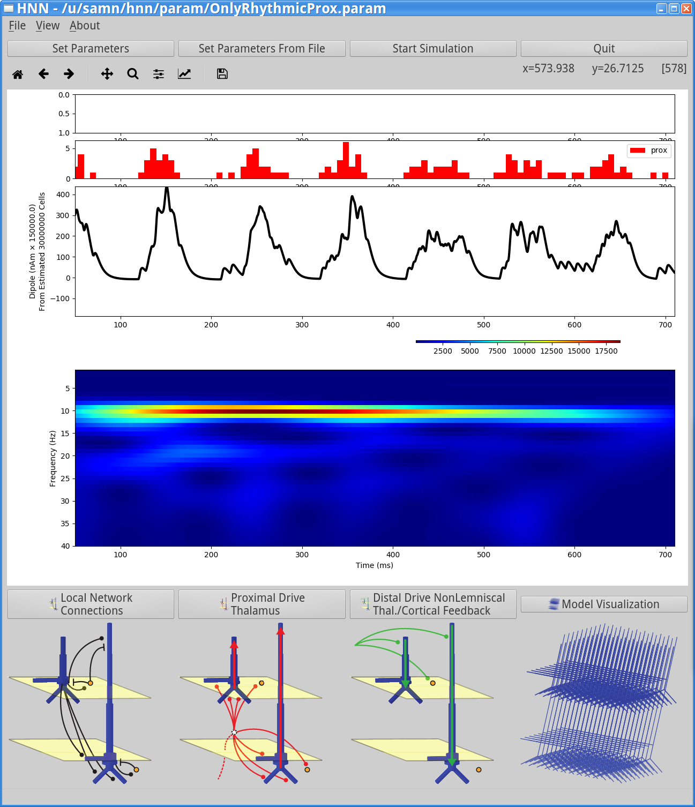

As shown above, rhythmic proximal input is provided at ~10 Hz -- this is seen in the red
histogram at the top of the output canvas. Due to the stochastic nature of the inputs, there
is some variability in the input times. The rhythmic inputs  generate ongoing alpha oscillations
in the model centered around 10 Hz. However, the current in the pyramidal neurons is only *pushed*
towards the supragranular layers, causing the dipole signal to only deviate above 0 nAm. This does not match
the experimental data accurately. In addition,  the ongoing alpha oscillation, throughout the simulation is
not realistic, since in the experiments alpha events are transient. 

Only Rhythmic Distal Inputs
^^^^^^^^^^^^^^^^^^^^^^^^^^^

Having seen that proximal inputs alone push the current flow only in a single direction, we
can confirm that the same occurs if we provide only rhythmic distal inputs, with the current
flowing largely in the opposite direction.

We will use a param file with rhythmic distal inputs provided at the alpha frequency (10 Hz).
Download the relevant param file
here: - `OnlyRhythmicDist.param <../../param/OnlyRhythmicDist.param>`_
Then load the parameter file values by clicking ``Set Parameters From File``
and selecting the file you just downloaded. To view the new parameters,
click on ``Set Paramters``, and then ``Rhythmic Distal Inputs``.
You should see the values displayed in the dialogs below.

.. |rhythdistonlytimingparamfig| image:: images/OnlyRhythmicDistTimingparam.png
        :scale: 40%
	:align: bottom

+-------------------------------+---------------------------+---------------------------+
| |rhythdistonlytimingparamfig| | |rhythdistonlyl2paramfig| | |rhythdistonlyl5paramfig| |
+-------------------------------+---------------------------+---------------------------+

Next, click on ``Start Simulation`` from the main GUI window.
Once completed, you will see output similar to that shown below.

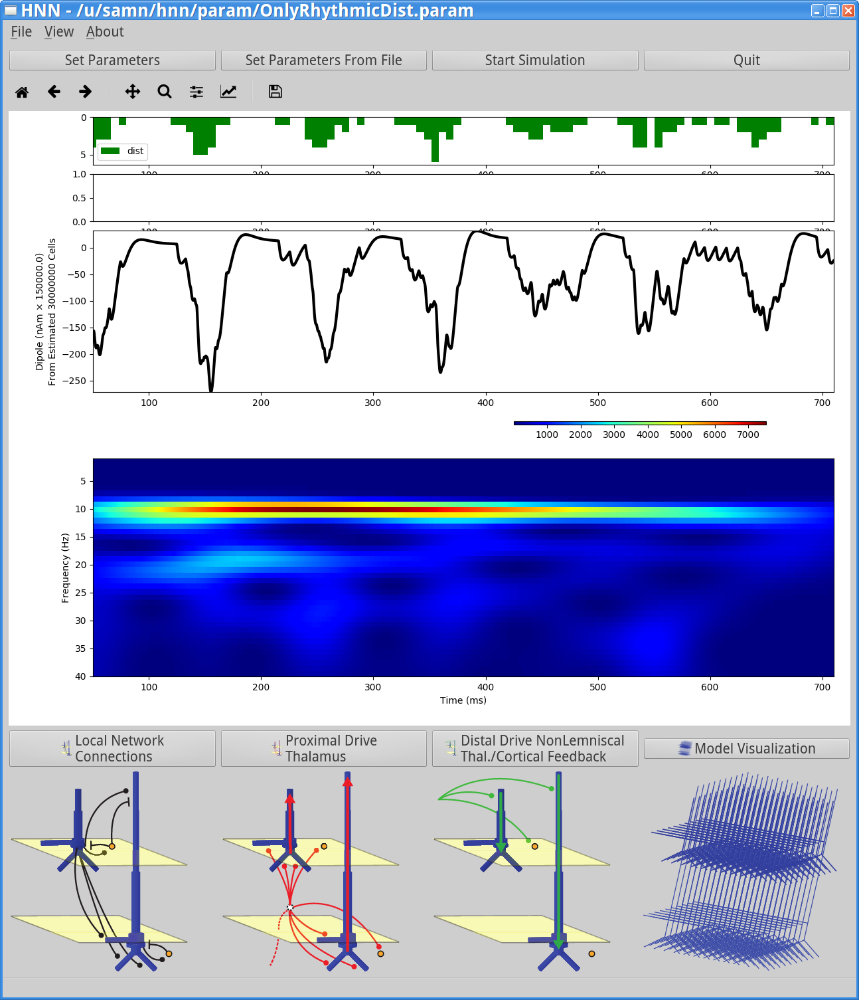

As shown here, rhythmic distal input is provided at ~10 Hz -- this is seen in the green
histogram at the top of the output canvas. The stochasticity of the inputs provides
variability in the input times. The rhythmic inputs generate ongoing alpha oscillations in the
model centered around 10 Hz. In this simulation the current in the pyramidal neurons is *pushed*
towards the infragranular layers, causing the dipole signal to only deviate below 0 nAm. This
simulation therefore also does not match the experimental data accurately. Once again, the
ongoing alpha oscillation throughout the simulation (seen in the 10 Hz band in the
spectrogram) is not realistic.

Combined Rhythmic Proximal/Distal Inputs
^^^^^^^^^^^^^^^^^^^^^^^^^^^^^^^^^^^^^^^^

Next, we'll look at providing both rhythmic proximal and rhythmic distal inputs. We will
use the same synaptic weights as used in the previous two simulations. 

We will use a param file with both rhythmic proximal and distal inputs provided at the alpha
frequency (10 Hz). Download the relevant param file
here: - `AlphaAndBeta.param <../../param/AlphaAndBeta.param>`_
Then load the parameter file values by clicking ``Set Parameters From File``
and selecting the file you just downloaded. To view the new parameters,
click on ``Set Paramters``, and then ``Rhythmic Proximal Inputs`` and ``Rhythmic Distal Inputs``.
You should see the values displayed in the dialogs below.

.. |alphaandbetaproxtimingparamfig| image:: images/AlphaAndBetaProxTimingparam.png
        :scale: 40%
	:align: bottom

.. |alphaandbetadisttimingparamfig| image:: images/AlphaAndBetaDistTimingparam.png
        :scale: 40%
	:align: bottom

+----------------------------------+----------------------------------+
| |alphaandbetaproxtimingparamfig| | |alphaandbetadisttimingparamfig| | 
+----------------------------------+----------------------------------+

Note that the ``Start time mean (ms)`` values for both proximal and distal inputs are
set to 50.0 ms. This allows for the proximal and distal inputs to overlap temporally
and produce either alpha or beta events. Alpha events are produced when the inputs occur
*out of phase* - which happens stocahstically. The reason this contributes to alpha is
that proximal inputs push the current flow in one direction and later distal
inputs push the current flow in the other direction; since both inputs are provided
rhythmically at 10 Hz. In contrast, when the proximal and distal events are *in phase*,
the proximal events push current flow upward (towards supragranular layers); while the
current is flowing upward the strong distal inputs push the current flow downward, cutting
the period in half and producing a beta event. We will look at this more closely in
later simulations.

Next, click on ``Start Simulation`` from the main GUI window.
Once completed, you will see output similar to that shown below.

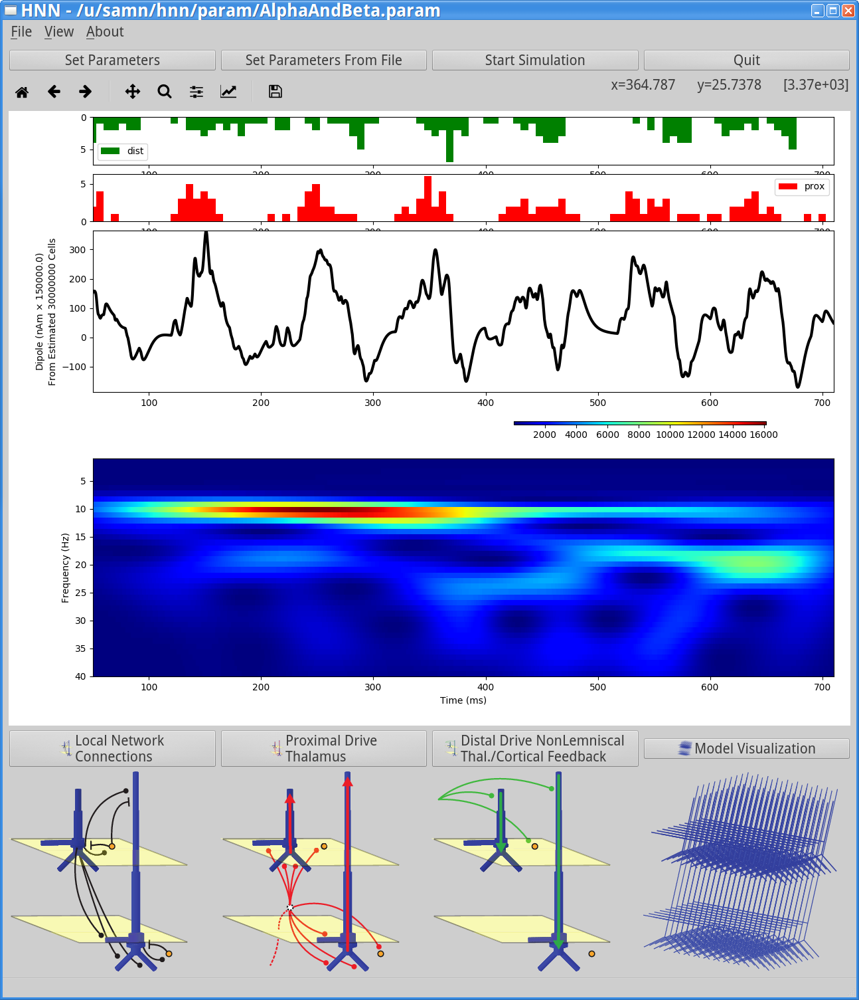

As shown here, both rhythmic proximal and distal inputs are provided at ~10 Hz -- seen in the
green (distal input) and red (proximal input) histograms at the top of the output canvas. The
stochasticity of the inputs provides variability in the input times. The rhythmic inputs generate
transient alpha and beta events, which depend on the relative temporal alignment of proximal and
distal events. In this simulation the current in the pyramidal neurons is *pushed* both above
(towards supragranular layers) and below (towards infragranular layers) zero nAm, closely
matching the experimental data. The model's transient alpha/beta events also provide additional
similarity to the experimental data. 

We can now check whether the network is generating any spiking activity. To do so, 
click on the ``View menu`` -> ``View Simulation Spiking Activity``. You should see the
following window.

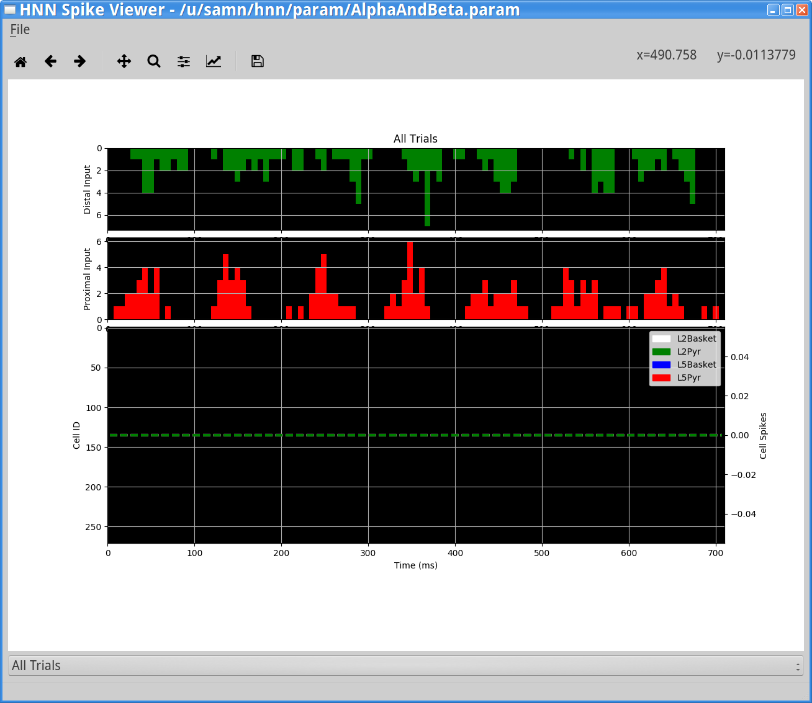

	Rhythmic distal (green/top) and proximal (red/middle) inputs produce the alpha
	and beta events through *subthreshold* processes. There is no spiking
	produced in the network (no dots present in the bottom raster plot). 

Next, we will use HNN to look at the simulation's power spectral density (PSD) -- the time
average of the spectrogram. To do so, click on the ``View menu`` -> ``View PSD``. You should see
the following window.

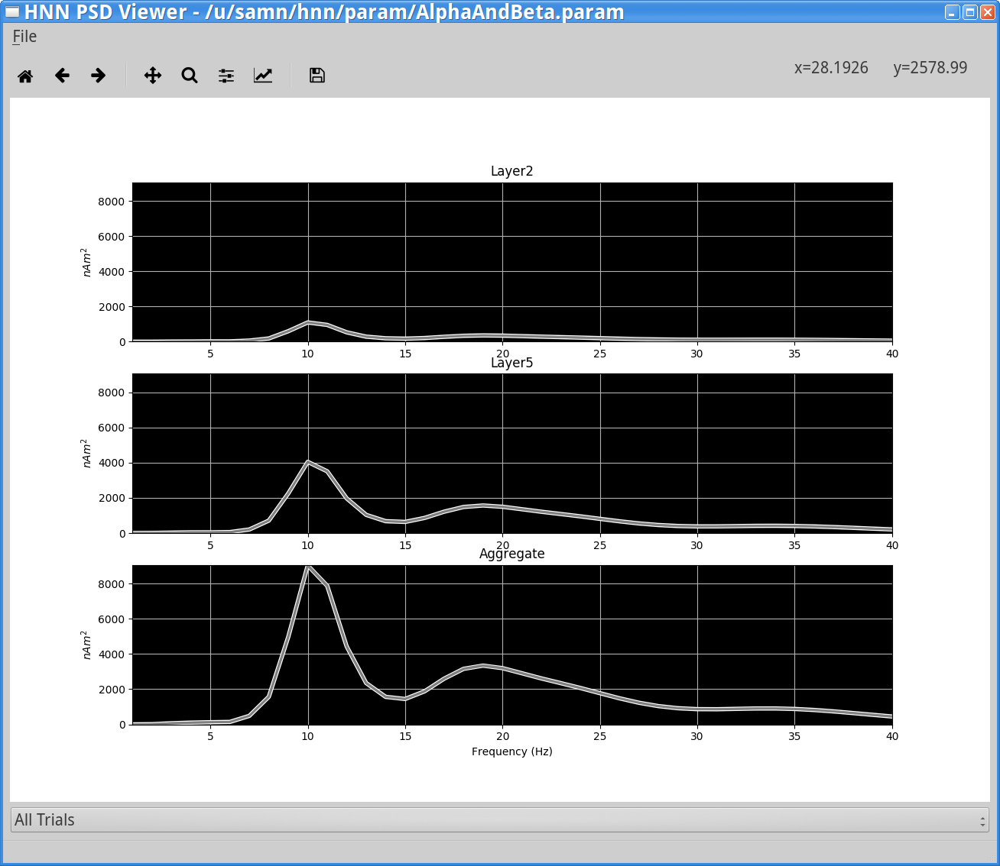

	Power spectral density from the simulation shows a strong peak at alpha (10 Hz), with
	a lower power in beta (~20 Hz). Top/middle/bottom panels show the PSD contributions
	from layer 2, layer 5, and the aggregate from layer 2 and layer 5.

We can also use HNN to compare to experimental PSD data. To do so, you will need time-series
of MEG data in a format that HNN can read (more details provided in data format section). Once
you have such data, you can load it with the HNN PSD viewer by clicking
``File menu`` -> ``Load data``, and then picking the file. Then HNN will calculate the PSD
from the time-series data and overlay it on the simulation PSD for comparison.
Below is an example.

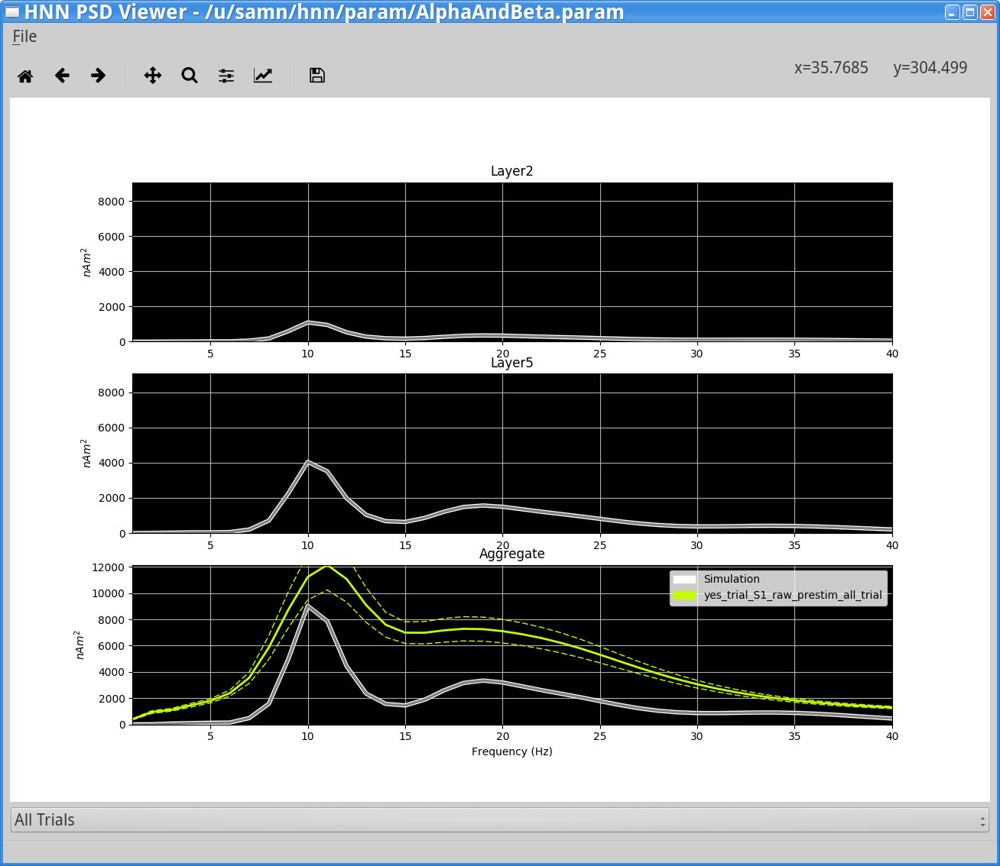

	Strong similarity of PSD generated by model (bottom white traces) and PSD from experimental
	MEG data (bottom yellow traces). Solid/dotted lines are mean+/-standard error. This data is
	from primary somatosensory cortex from spontaneous prestimulus activity.

Stronger Beta
^^^^^^^^^^^^^

Above we mentioned that the timing of proximal and distal inputs can lead to either alpha
(when events are out of phase phase) or beta (when events are in phase).  Another factor
that contributes to the prevalence of beta events is the *strength* and *synchrony*
of the distal inputs. This is because stronger and more synchronous distal inputs are more
effective in opposing the proximal inputs, and in pushing the current flow towards infragranular
layers, which contributes to the typical 20 Hz waveform seen in the dipole. We will demonstrate
this in the next simulation. 

We will use a param file with both rhythmic proximal and distal inputs provided at 10 Hz, with
stronger, more synchronous distal inputs. Download the relevant param file
here: - `AlphaAndMoreBeta.param <../../param/AlphaAndMoreBeta.param>`_
Then load the parameter file values by clicking ``Set Parameters From File``
and selecting the file you just downloaded. To view the new parameters,
click on ``Set Paramters``, and then click ``Rhythmic Distal Inputs``.
You should see the values displayed in the dialogs below.

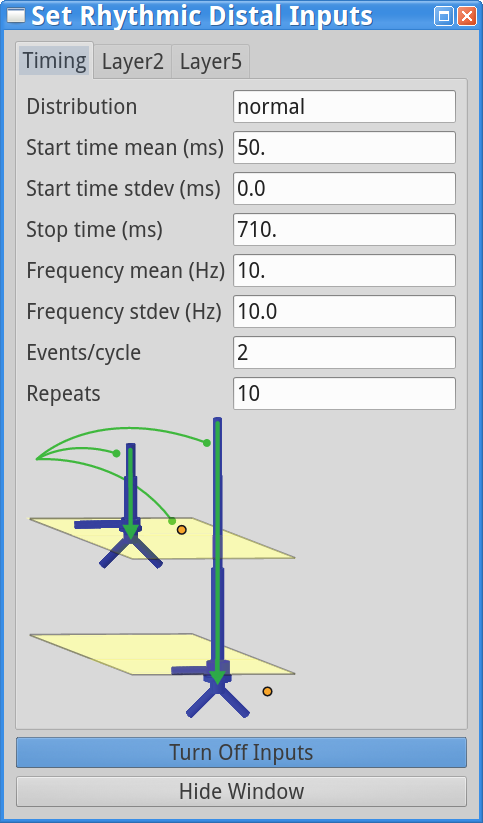

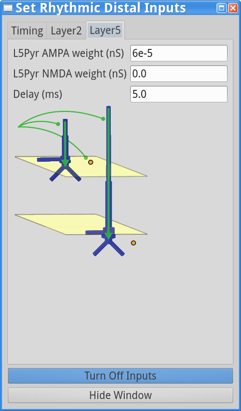

+--------------------------------------+----------------------------------+----------------------------------+
| |alphaandmorebetadisttimingparamfig| | |alphaandmorebetadistL2paramfig| | |alphaandmorebetadistL5paramfig| |
+--------------------------------------+----------------------------------+----------------------------------+

Key parameter changes include a reduction in the ``Frequency stdev (Hz)`` value - to 10.0 instead
of the previous 20.0. This creates higher synchrony in the timing of the distal inputs. In addition
the weights of the distal inputs have been increased, allowing the distal inputs to more effectively
push current flow down the dendrites towards infragranular cortical layers. 

Next, we will test how these parameters effect the simulation dynamics. Click on ``Start
Simulation`` from the main GUI window. This simulation runs for ~700 ms of simulation time. Once
completed, you will see output similar to that shown below.

.. figure:: images/AlphaAndMoreBetaOutput.png
	:scale: 40%	
	:align: center

As seen in the narrower green histograms at the top of the output canvas, the distal inputs are
provided more synchronously. This produces higher beta power around 20 Hz - seen in the higher
prevalence as well as higher power in the beta band (note the red regions in the spectrogram
around 20 Hz). 

Now we will use HNN to further verify that the simulation produces more beta than previously by looking
at the simulation's power spectral density (PSD). To do so, click on the ``View menu`` -> ``View
PSD``. You should see the following window.

.. figure:: images/AlphaAndMoreBetaViewPSD.png
	:scale: 40%	
	:align: center

	Power spectral density from the simulation shows a larger beta than alpha amplitude in the
	L5 (middle panel) and aggregate PSD (bottom panel).

Even Stronger Distal Weights
^^^^^^^^^^^^^^^^^^^^^^^^^^^^

We will now demonstrate what happens if we increase the strength of the distal inputs too far. Instead of getting
the usual alpha/beta events we will see activity dominated by neuronal spiking. This type of activity
is not typically observed in the MEG data, supporting the notion that alpha/beta rhythms are created through
subthreshold processes. Let's test this with the following simulation.

We will use a param file with both rhythmic proximal and distal inputs provided at 10 Hz, with
stronger distal inputs compared to the original AlphaAndBeta.param file used above. Download the
new param file here: - `AlphaAndBetaSpike.param <../../param/AlphaAndBetaSpike.param>`_
Then load the parameter file values by clicking ``Set Parameters From File``
and selecting the file you just downloaded. To view the new parameters,
click on ``Set Paramters``, and then click ``Rhythmic Distal Inputs``.
You should see the values displayed in the dialogs below.

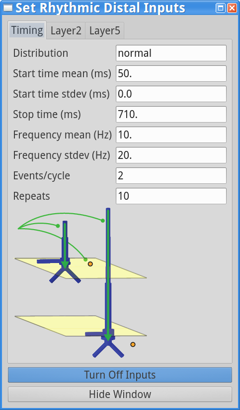

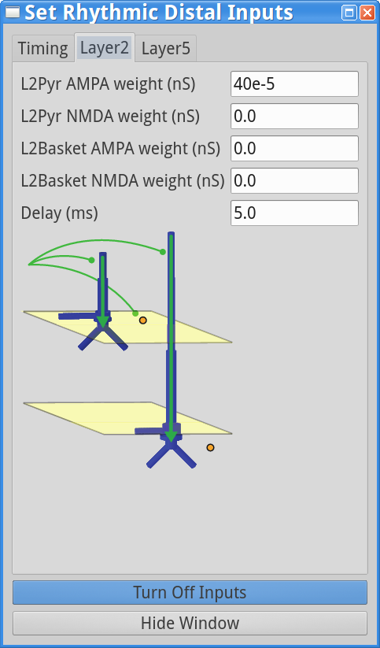

+---------------------------------------+-----------------------------------+-----------------------------------+
| |alphaandbetaspikedisttimingparamfig| | |alphaandbetaspikedistL2paramfig| | |alphaandbetaspikedistL5paramfig| |
+---------------------------------------+-----------------------------------+-----------------------------------+

Note the high weights of distal inputs to L2Pyr (40e-5 nS) and L5Pyr (40e-5 nS). These are sufficient
to generate spiking activity in the neurons.

Next, we will run the simulation. Click on ``Start Simulation`` from the main GUI window. Once
completed, you will see output similar to that shown below.

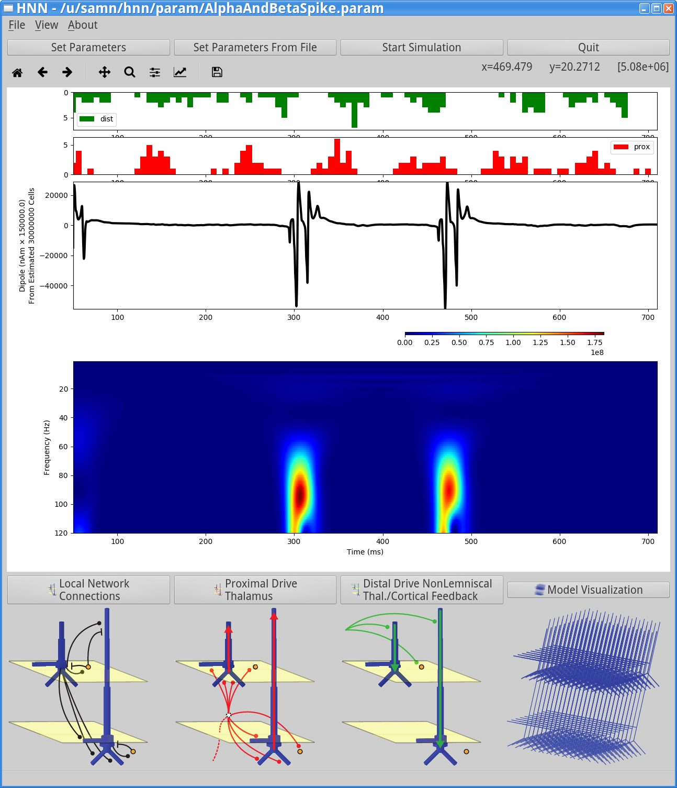

	This output reflects spiking activity from the pyramidal neurons which produces similarly sharp
	spiking activity in the dipole signal. As a result the dipole spectrogram shows broadband spiking
	from ~60-120 Hz. This type of activity is not typically seen in MEG data.

Now we will use HNN to further verify that the simulation produces more beta than previously by looking
at the simulation's power spectral density (PSD). To do so, click on the ``View menu`` -> ``View
PSD``. You should see the following window.

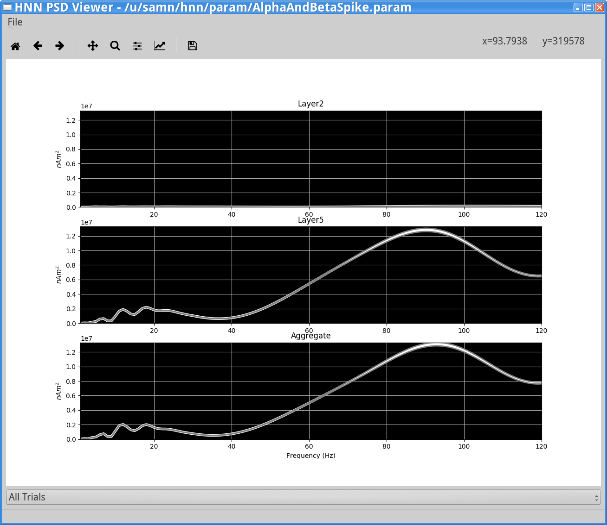

	PSD from the simulation shows high frequency activity caused by neuronal spiking.

We can verify that the neurons are spiking by looking at the raster plots. 

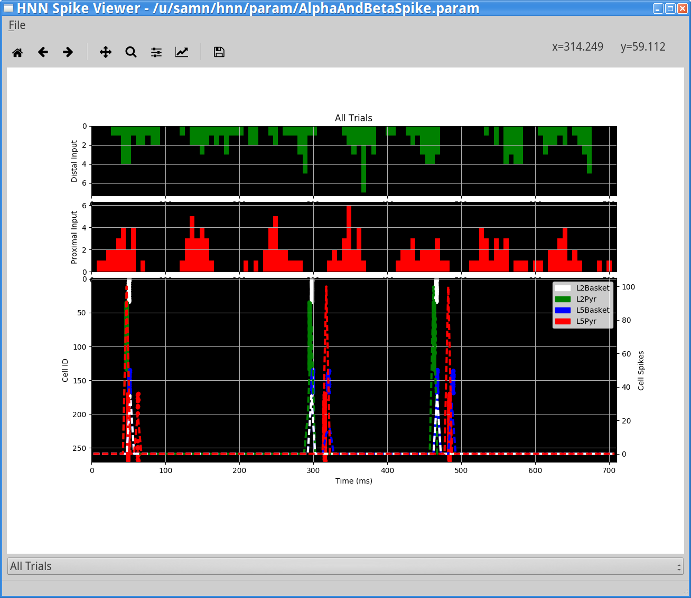

	Neuronal spiking coincides with the high-frequency events seen in the spectrogram.
	**Note the highly synchronous spikes in the raster plot.**

We use this simulation to demonstrate that HNN can be used to test the limits of physiological
variables and to test how simulations can be similar or dis-similar to experimental data. 

Alpha through out of phase inputs
^^^^^^^^^^^^^^^^^^^^^^^^^^^^^^^^^

We mentioned above that the relative timing of proximal and distal inputs is an important
factor in determining whether alpha or beta events would arise. We will now demonstrate
that out of phase inputs tends to produce ongoing alpha rhythms.

We will use a param file with rhythmic proximal and distal inputs provided at 10 Hz, with
and proximal out of phase with distal inputs. Download the
new param file here: - `Alpha.param <../../param/Alpha.param>`_
Then load the parameter file values by clicking ``Set Parameters From File``
and selecting the file you just downloaded. To view the new parameters,
click on ``Set Paramters``, and then click ``Rhythmic Proximal Inputs`` and ``Rhythmic Distal Inputs``.
You should see the values displayed in the dialogs below.

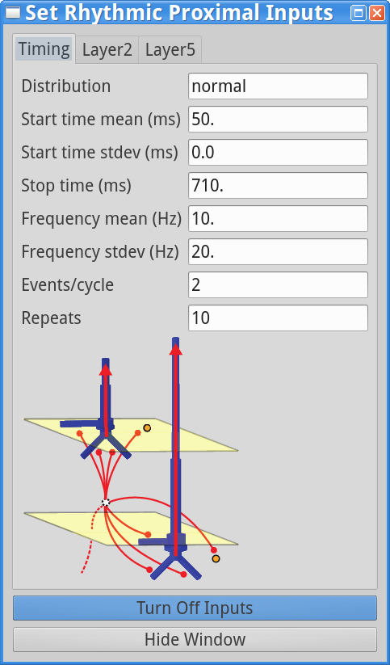

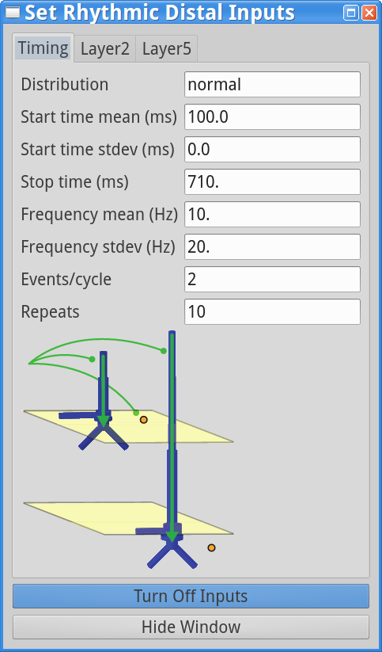

+---------------------------+---------------------------+
| |alphaproxtimingparamfig| | |alphadisttimingparamfig| |
+---------------------------+---------------------------+

Note that the proximal inputs have a ``Start time mean (ms)`` of 50.0
while the distal inputs have a ``Start time mean (ms)`` of 100.0. Since
both have ``Frequency mean (Hz)`` of 10.0, the proximal and distal inputs
are on average 1/2 cycle out of phase. 

To see how this impacts the model output, we will run the simulation. Click on ``Start Simulation``
from the main GUI window. Once completed, you will see output similar to that shown below.

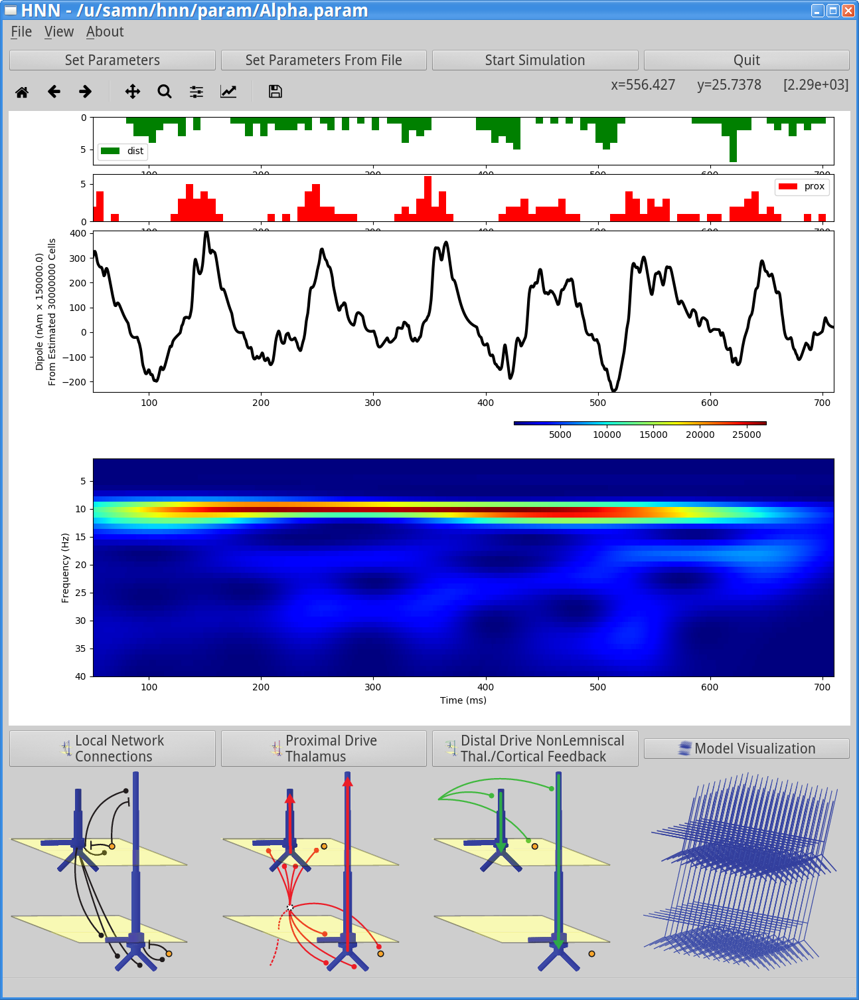

As seen, the peaks of the distal (green) and proximal (red) histograms at the top of the output
canvas are generally *out-of-phase*. This rhythmic alternation of proximal and distal inputs at
10 Hz produces an alpha rhythm. In this case, the dipole signal is pushed both above and below
0 nAm. However, the nearly continuous rhythm is not typically seen in MEG data. 

Rhythmic inputs across multiple trials/jitter
^^^^^^^^^^^^^^^^^^^^^^^^^^^^^^^^^^^^^^^^^^^^^

When running MEG experiments, it's typical to run multiple trials, and then calculate
the average spectrogram from the data obtained. This can produce the impression that
oscillations are continuous, as shown in the figure below. 

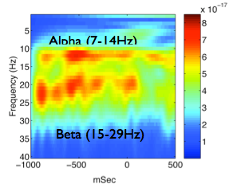

	Average spectrogram of MEG data from 100 trials shows nearly continuous
	alpha and beta oscillations. Are these oscillations always present or
	is this just an artifact of the averaging procedure?

We can use HNN to test these averaging effects by running multiple trials with
ongoing rhythmic inputs. Since the inputs have stochasticity, there will be some
variation in when the transient alpha/beta events occur in differnet trials, and
this could contribute to the temporal blurring across trials. We will test this in the
next simulations.

We will use a param file with rhythmic proximal and distal inputs provided at 10 Hz, with
proximal and distal inputs in phase. These are the same parameters as in the AlphaAndBeta.param
file, but with 10 trials instead of 1. Download the
new param file here: - `AlphaAndBetaJitter0.param <../../param/AlphaAndBetaJitter0.param>`_
Then load the parameter file values by clicking ``Set Parameters From File``
and selecting the file you just downloaded. To view the new parameters,
click on ``Set Paramters``, and then click ``Run``, ``Rhythmic Proximal Inputs``, and ``Rhythmic Distal Inputs``.
You should see the values displayed in the dialogs below. 

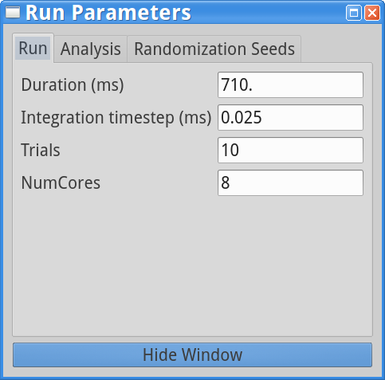

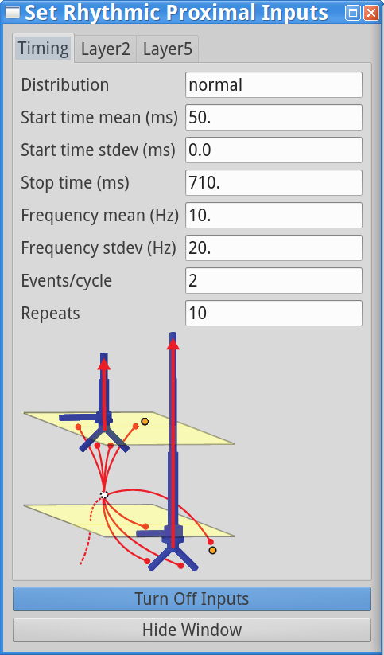

.. |alphabjitter0disttimingparamfig| image:: images/AlphaAndBetaJitter0DistTimingparam.png
        :scale: 40%
	:align: bottom

+----------------------------+-----------------------------------+-----------------------------------+
| |alphabjitter0runparamfig| | |alphabjitter0proxtimingparamfig| | |alphabjitter0disttimingparamfig| |
+----------------------------+-----------------------------------+-----------------------------------+

Note that there are 10 trials in the ``Run Parameters`` and the ``Start time stdev (ms)`` is set
to 0.0 for both proximal and distal inputs.

Let's run the simulation. Click on ``Start Simulation``
from the main GUI window. This simulation will take longer to run because it uses 10 trials.
Once completed, you will see output similar to that shown below.

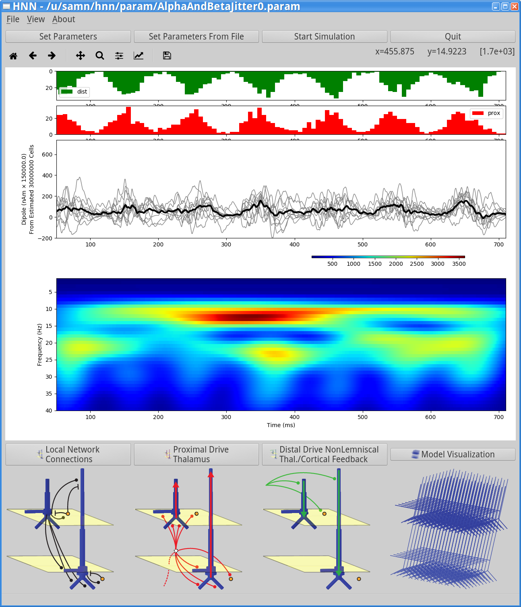

	Average spectrogram from 10 trials of ongoing rhythmic inputs produces blurring of alpha/beta
	events across time. **Note that the dipole signals were not averaged; rather tha individual 
	spectrograms were averaged across trials.** This averaging produces a nearly continuous band
	of alpha oscillations and more continuous beta events. Running more simulations will increase blurring. 

We can refine control of the amount of temporal blurring by modulating a jitter parameter. 
This jitter parameter modulates the start time of the rhythmic inputs, adding more variability
to when the transient alpha/beta events occur, and producing even more temporal blurring.

To demonstrate this, ...

As an exercise, try decreasing or increasing the number of trials in both of these simulations to see how that
impacts the absence/presence of continuous alpha/beta oscillations.

Gamma Rhythms
-------------

