How to Simulate:
================

Here we demonstrate how to use the HNN software to simulate
several patterns of interest: 

 1. Event Related Potentials (ERPs)
 2. Alpha/Beta Rhythms
 3. Gamma Rhythms

We take you step-by-step through the parameter settings required
to replicate the dynamics, and ahow you how to compare experimental
data to the model output. We also provide the parameter (.param) files
which contain parameter values to generate the dynamics. This way, you
can load the parameter files and run the model with *correct* parameter
values, without having to enter all the values manually.

Event Related Potentials (ERPs)
-------------------------------

We begin with running simulations of ERPs. ERPs are detectable
in EEG/MEG recordings from sensory brain areas in response to
sensory events. For example, when a tactile stimulus is applied
to the hand, after a delay, an ERP can be detected in somatosensory
cortex. ERPs have prototypical waveforms. However, the mechanisms
that lead to ERPs are not fully known. Previous modeling has demonstrated
that the timing and strength of inputs arriving into different cortical
layers is responsible for generating the events. 

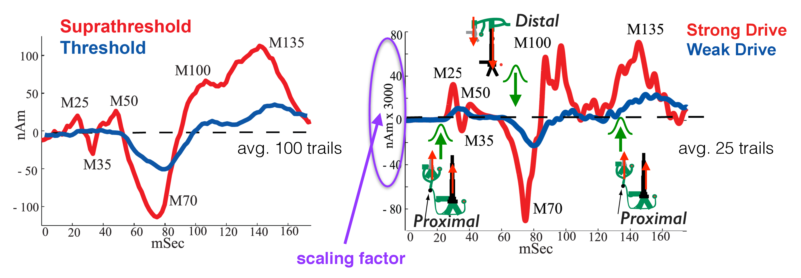

	**Comparison of ERP in experiment and simulation.** Left: MEG experiment showing
	ERP in response to tactile stimulation.
	Red: suprathreshold/detected trials; Blue: Threshold detected trials.
	Right: Simulation showing proximal/distal inputs needed to replicate the
	ERP waveform from MEG experiment. Note *scaling factor* which multiplies the dipole
	signal generated by the model to match to the MEG ERP data, and used to predict the number
	of neurons contributing to an ERP.

We will use HNN to
generate ERP waveforms which have close similarity with ERPs from
primary somatosensory cortex (S1) *in vivo* MEG experiments. These
experiments were previously published (refs), and involve tactile
stimulation. The data is split into two conditions: yes (detected)
and no (non-detected) trials. As we will see, the ERP waveforms
differ noticeably.

Load/view parameters
^^^^^^^^^^^^^^^^^^^^

To run the simulations yourself, first download the param file
here: - `ERPYes100Trials.param <../../param/ERPYes100Trials.param>`_
Then load the parameter file values by clicking ``Set Parameters From File``
and selecting the file you just downloaded.

To view the parameters, click on ``Set Paramters``, and then ``Evoked Inputs``.
You should see the values displayed in the dialogs below.

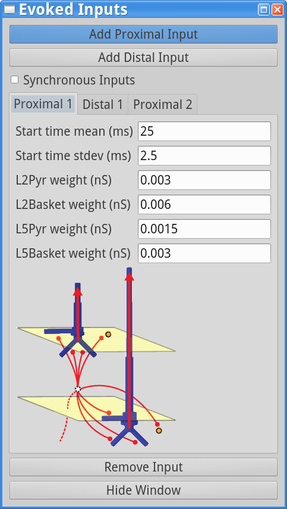

.. |erpdist1fig| image:: images/ERPYesDist1param.png
        :scale: 40%
	:align: bottom

.. |erpprox2fig| image:: images/ERPYesProx2param.png
        :scale: 40%
	:align: bottom

+---------------+---------------+---------------+
| |erpprox1fig| | |erpdist1fig| | |erpprox2fig| |
+---------------+---------------+---------------+

These parameters were set so as to grossly match the model ERP waveforms
to those seen in the MEG data.

Running the simulation will produce the output shown below. The thin gray
traces are dipole signals from individual trials while the thick black
trace is the average ERP. 

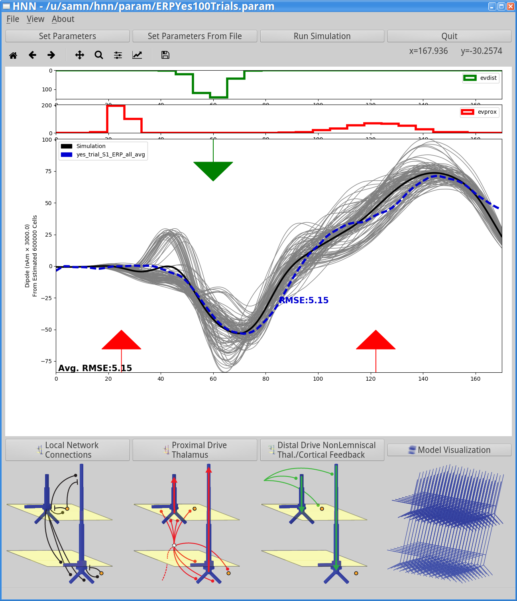

	If you had run the model with these settings and 100 trials you would see the output below. 
	In addition, this figure shows comparison to the MEG data and the root-mean-squared-error
	comparison. Note the close similarity of model and experimental data. Below, we will describe
	how to load the MEG data provided with HNN.

Running the simulation
^^^^^^^^^^^^^^^^^^^^^^

Next, we will change the ``simulation name``, and reduce the number of trials so that you can run the model
on your laptop. Enter a new *descriptive* name for the simulation here, for example *ERPYes2Trials*:

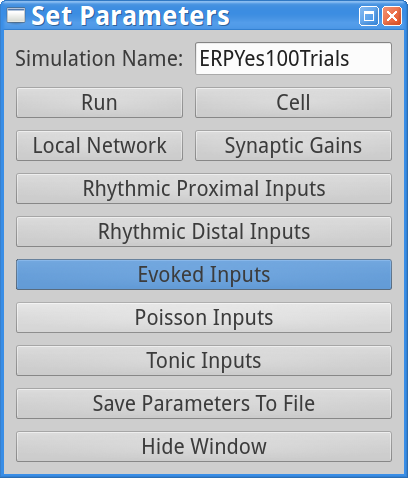

Now press the ``Run`` button on the ``Set Parameters`` dialog box to change the number of trials from 100 to 2:

**Note: NumCores is the number of cores to parallelize the model, is automatically detected by HNN
and may differ, depending on your hardware.**

Next, press the ``Start Simulation`` button from the main GUI window. This will start the simulation,
and should take 1-2 minutes, depending on your hardware. 

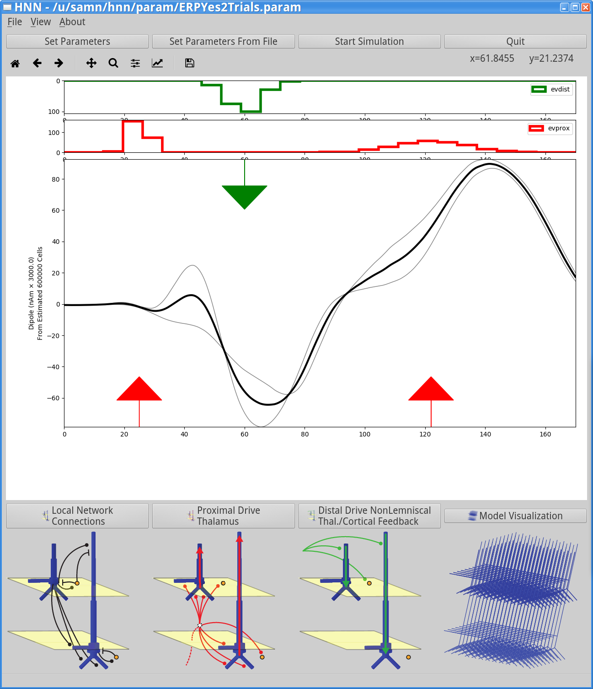

	Drawing on white canvas shows the model output after running 2 trials. The top two panels show the histogram
	of input times with distal evoked inputs in green (*evdist*) and proximal evoked inputs in red (*evprox*).
	The bottom panel shows the dipole signals. The gray traces are from individual trials while the black trace
	is the average across trials. The red and green arrows indicate the times and directions of current flow
	within the pyramidal neurons produced by proximal and distal evoked inputs, respectively. Note that the y-axis
	scales the simulated dipole by 3000.0, implicitly predicting the number of cells that contribute to the
	signal (here 600,000 cells; consistent with experimental data).

A closer look at simulation output
^^^^^^^^^^^^^^^^^^^^^^^^^^^^^^^^^^

Next, we can examine the simulation data more closely. 

First, let's look at the dipole signal contributions from individual layers. From the main GUI window,
click on the ``View menu`` -> ``View Simulation Dipoles``. You should see the following window.

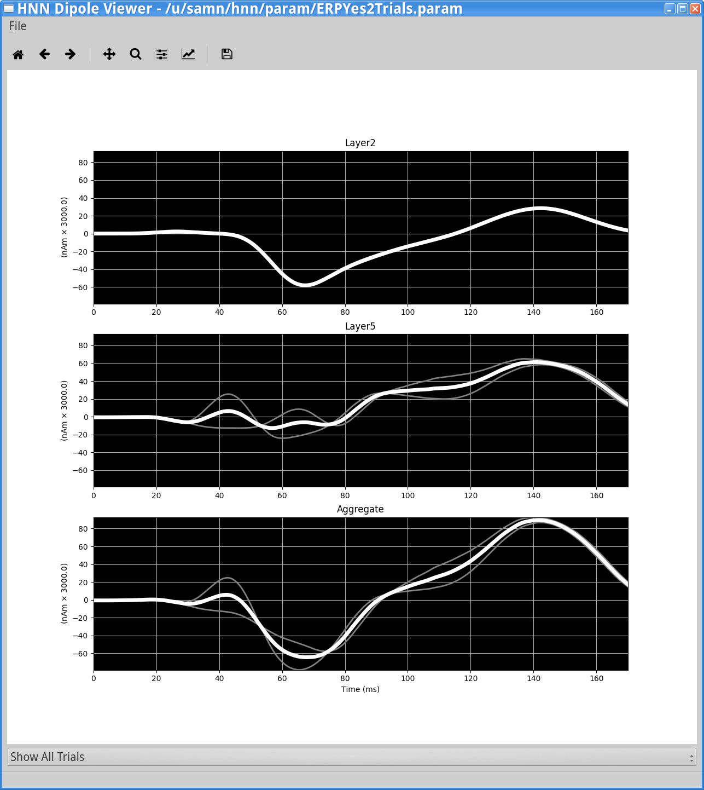

	This window shows the dipole contributions from Layer2 (top), Layer5 (middle), and the
	aggregate (bottom). Note the different features in Layer2 vs Layer5 dipole signals, allowing
	you to tease apart how the different cortical layers contribute to different waveform features.
	In this figure the gray traces are from individual trials and the white trace
	is the average across trials. The same dipole scaling factor is used (3000.0). The bottom
	drop-down menu which currently has ``Show All Trials`` selected allows you to change the
	view to show the dipole signals from an individual trial. You can also save the image using
	the standard ``matplotlib`` menu at the top. 

Next, let's examine the spiking generated by neurons in the network. From the main GUI window,
click on the ``View menu`` -> ``View Simulation Spiking Activity``. You should see the
following window.

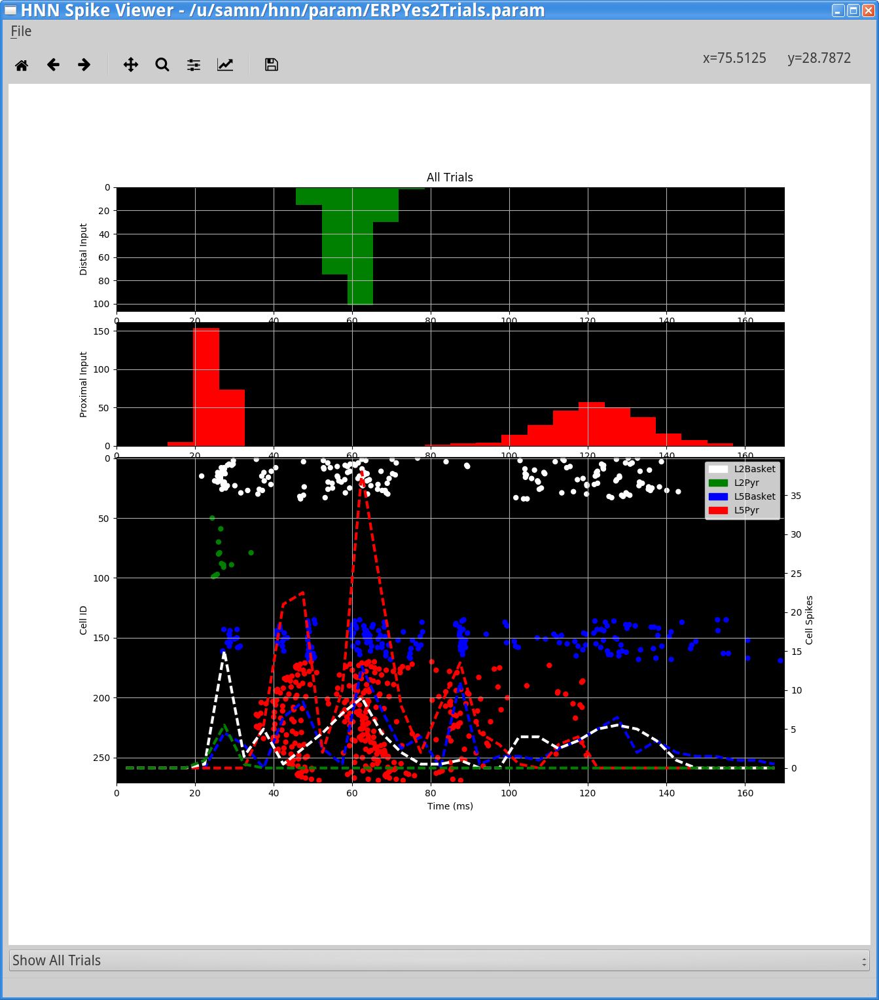

	This window shows the spiking activity produced by the model in response to the evoked
	inputs. The top and middle panels show histograms of distal evoked inputs (green) and
	proximal evoked inputs (red) provided to the neurons. The bottom panel shows a raster
	plot of the spiking activity generated by the neurons (x-axis: time in ms; y-axis neuron
	identifier). The neuron identifiers are arranged vertically by layer, with top
	representing supragranular layers and the bottom representing the infragranular layers.
	Individual neuron types are drawn in the different colors shown in the legend. The dotted
	lines show a time-series of summed activity, per population (same color code as the
	individual spikes). The initial view shows the aggregate spiking activity across trials. To
	see spiking activity generated by a single trial select the trial number using the combination
	box at the bottom of the window. This window also provides the standard save/navigation functionality
	through the ``matplotlib`` control at the top.

Comparing to MEG ERP data
^^^^^^^^^^^^^^^^^^^^^^^^^

Now that we have run the simulation we can compare how well its ERP waveform fits the ERP
seen in the MEG experiments. We have provided data from the Jones 2007 (ref) paper in a format
that HNN can read (described here). To load the data go to ``File menu`` -> ``Load data file``
and select ``data/MEG_detection_data/yes_trial_S1_ERP_all_avg.txt`` (``data`` is a subdirectory
under the main hnn install location). HNN will then load the data and display the waveform
in the dipole window as shown below.

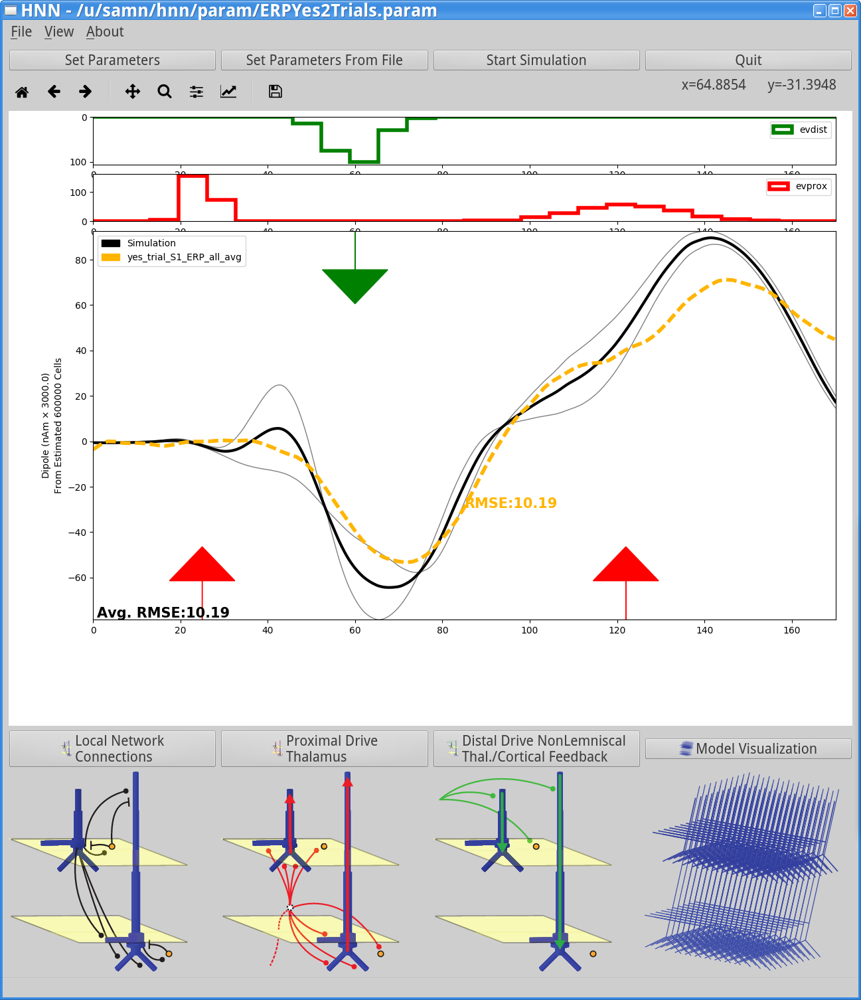

	This figure shows a comparison of mode land MEG ERP waveforms for the ``yes/detected`` condition.
	The MEG ERP is drawn in the yellow dotted-line, while the average simulation ERP waveform is drawn
	in black. HNN also calculates the root-mean-squared-error (RMSE) between the average simulation ERP
	waveform and the waveform loaded from the .txt file. As seen in the figure, the RMSE is 10.19. Above,
	when we ran more trials, the ERP was considerably lower - at 5.15. If you run more trials with the same
	parameters you should be able to reduce the RMSE.

Adjust Evoked Inputs
^^^^^^^^^^^^^^^^^^^^

Now let's practice adjusting the evoked input parameters. We can tell HNN to provide synchronous evoked inputs
to all the neurons. This will reduce variability in timing of evoked inputs producing a stronger response. 
*Question: will this also improve goodness-of-fit to the MEG data?*

All we'll do now is set the evoked inputs to *synchronous* -- so that all relevant neurons get the proximal/distal
inputs at the same time. First change the ``simulation name`` to *e.g.* ERPYes2TrialsSync in the main
``Set Parameters`` window. If you don't still have the ``Evoked Inputs`` dialog window open, click 
the ``Evoked Inputs`` button in the ``Set Parameters`` window. Then, make sure the box with
``Synchronous Inputs`` is checked. Then press ``Start Simulation``.

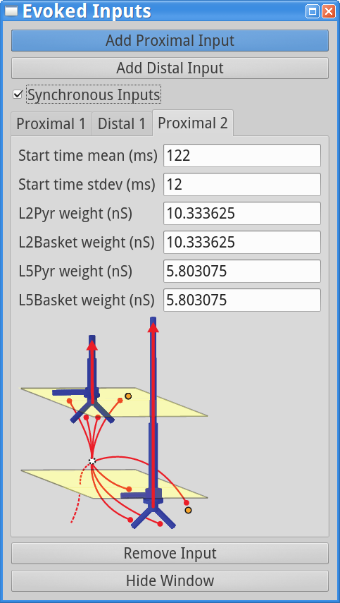
	
After the simulation has completed you'll see the following output. Although the model 
replicates gross features of the MEG data, the fit to the
is now substantially worse (RMSE of 23.31). Also note that there is much lower
variability of the input times in the green/red histograms at the top of the output canvas.

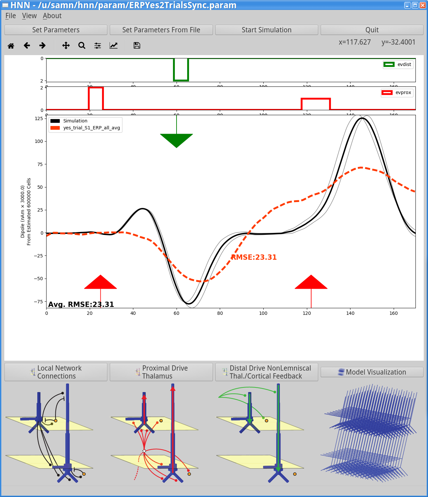

If you're adventurous and have some time, try running the same parameters with 100
trials. That will reduce the RMSE, producing output similar to that shown here.

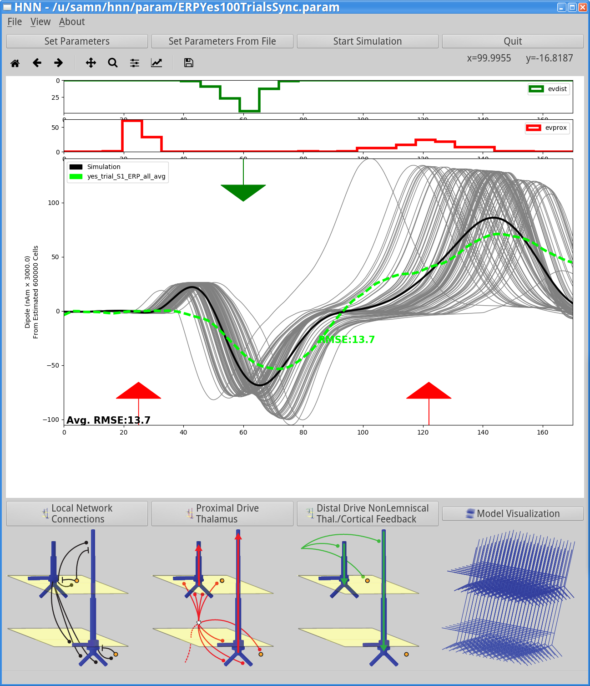

	Output from 100 trials with *synchronous* evoked inputs. Note that the fit to
	the MEG data is now improved (RMSE of 13.7).

Next, we'll look at the MEG data from *no/non-detected* trials. We'll look at how
to adjust the evoked input parameters to better match this model. First, let's clear
the MEG data from the detected trials. To do this, go to ``File menu`` -> ``Clear data file``
from the main GUI window. Next, load the data from the non-detected trials. Go to
``File menu`` -> ``Load data file`` and select ``data/MEG_detection_data/no_trial_S1_ERP_all_avg.txt``.
HNN will recalculate the model fit to the data, showing a poor fit (RMSE of 32.19). 

.. figure:: images/ERPYes100SyncCompareToNo.png
	:scale: 40%	
	:align: center

	Model run with *yes* parameter has poor fit to the MEG data from *no* trials.
	(*yes* means detected; *no* means non-detected trials)

Next, we'll load the
.param file with parameter values to match this MEG data.  First download the param file
here: - `ERPNo100Trials.param <../../param/ERPNo100Trials.param>`_
Then load the parameter file values by clicking ``Set Parameters From File``
and selecting the file you just downloaded. To view the new parameters,
click on ``Set Paramters``, and then ``Evoked Inputs``.
You should see the values displayed in the dialogs below.

Alpha/Beta Rhythms
------------------

Gamma Rhythms
-------------

