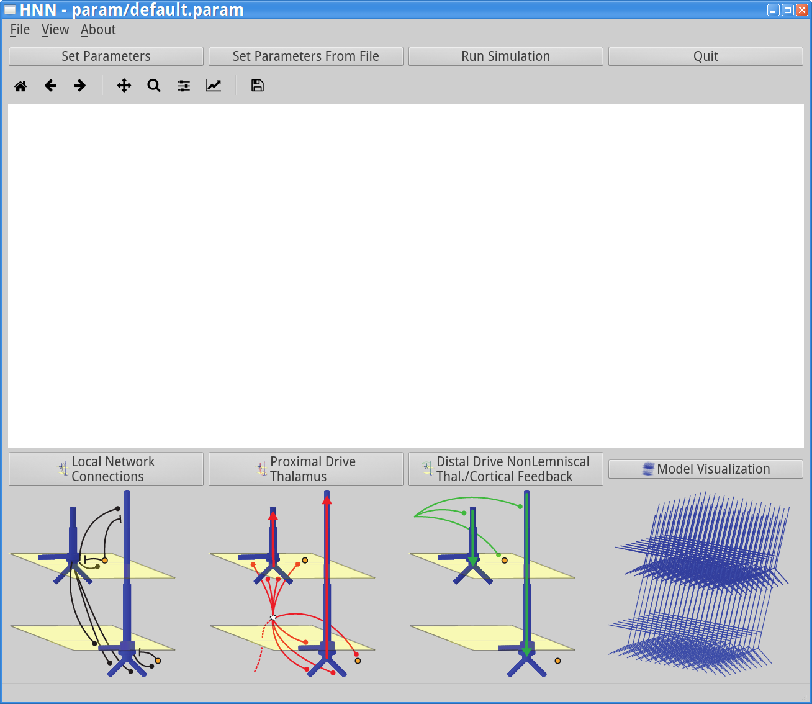

Installing & Running HNN
=======================================

Requirements
------------

HNN requires Python 3.x (`<www.python.org>`_) and the NEURON simulation environment (`<www.neuron.yale.edu>`_)
compiled to use Python3 and optimally, with MPI support. 

Required packages:
 #. MPI
 #. Matplotlib
 #. NEURON compiled with MPI, Python support - $PYTHONPATH must point to Python 3
 #. Numpy
 #. PyOpenGL
 #. Python3
 #. PyQt5
 #. pyqtgraph
 #. Scipy

These packages are automatically installed when running the installation scripts provided below. However,
if your operating system does not yet have an installer, you could install the required packages manually
and then install the HNN code itself using the source-code from the bitbucket repository: http://bitbucket.org/samnemo/hnn .
For more information and/or questions about this contact samuel_neymotin@brown.edu .

Installing HNN
--------------

We have provided installation scripts for CentOS and Ubuntu below. Mac OSX and Windows installers
are currently in development. 

 #. `CentOS install script <https://bitbucket.org/samnemo/hnn/src/70f8db5fc7310a811378920d61954d0277abe8c8/installer/centos/build.sh?at=master>`_ 
 #. `Ubuntu install script <https://bitbucket.org/samnemo/hnn/src/70f8db5fc7310a811378920d61954d0277abe8c8/installer/ubuntu/build.sh?at=master>`_

To install using these scripts, download the installer appropriate for your
operating system. Then from
a terminal, change into the directory with the ``build.sh`` script and run 
``sudo ./build.sh`` on CentOS or ``sudo source build.sh`` if you are using Ubuntu.
**Note: you will need to enter the sudo password.** The build.sh script will take
at least a few minutes to run, depending on your operating system and hardware.

Starting HNN
------------

First start a terminal. Then change into the directory
where HNN is installed with ``cd path_to_hnn``. Next, from the
terminal, run the HNN startup script ``hnn.sh``. If everything
is installed correctly, you will see the HNN graphical user interface (GUI),
as shown below. Note that the empty white area in the GUI is 
where simulation data is displayed. Since no simulation was run, the
area is empty. 

Test run
--------

To test the default simulation press the ``Run Simulation`` button.
You will be asked if you want to over-write the default.param file.
Press the OK button to confirm and the simulation will begin. 
Then, a simulation that displays ongoing alpha (~10 Hz) and beta (~20 Hz)
oscillations will begin. After 1-2 minutes (depending on your hardware), you will
get notified in a dialog window that the simulation has run to completion. Press OK
and you should see the output in the main GUI window, as displayed below. 

.. image:: images/starthnndefaultrun.png
	:width: 50%	
	:align: center

.. _simdefoutput:
The simulation output displayed  consists of several panels. The top panels
represent histograms of the inputs provided to the neurons. Note their rhythmicity, which
contributes to alpha/beta events. The middle panel shows the dipole signal generated
by the model. Note the units are in nAm, and directly comparable to data from MEG
experiments. The bottom portion show a wavelet-based spectrogram from the current
dipole signal. In the Tutorial, we will provide more information on what the output
represents. 
