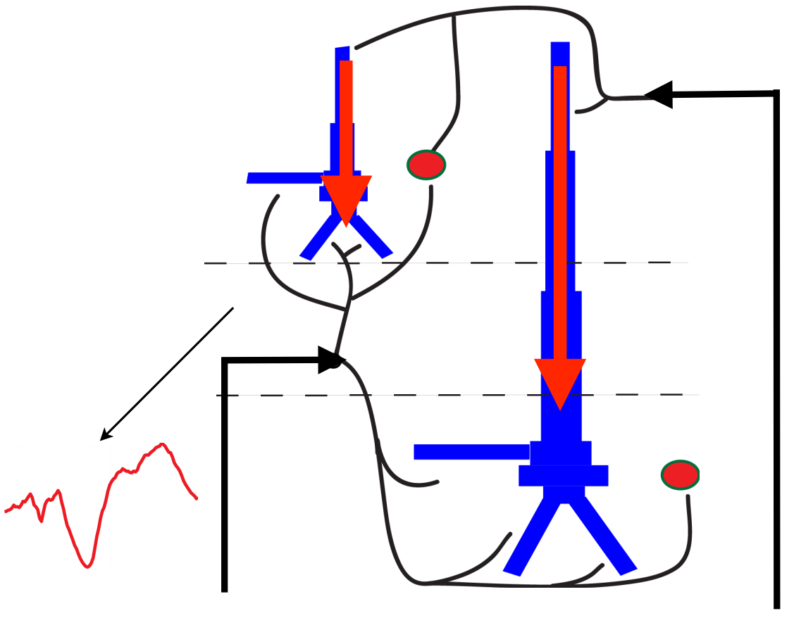
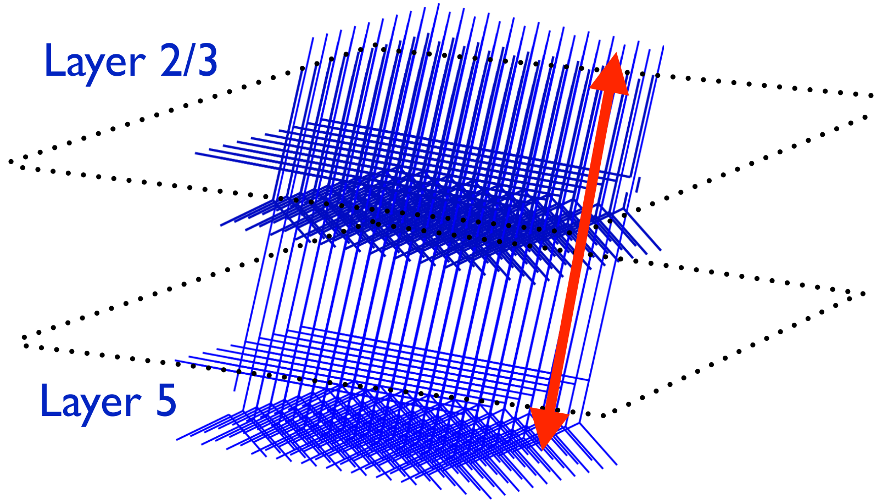

.. (need good schematic) ;  - 
Model (under the hood)
======================

Overview
--------

HNN"s biophysical neural model captures the laminar structure of cortical
columns, and how this model can be used to make predictions on the cellular and circuit level origins of
brain oscillations measured with MEG/EEG. Specifically, we describe how the model can be used to
simulate current dipole activity, the common macroscopic signal inferred from MEG/EEG data. 
While the details of the
model are specific to the somatosensory system, the model design and application are based on general
principles of cortical circuitry and MEG/EEG physics, and are thus amenable to the study of rhythms in
other frequency bands and sensory systems.

HNN's biophysical model
-----------------------

Neocortical circuits are organized with remarkably similar features across areas and species. These
features include a common laminar structure with generalizable cell classes, and similar local connectivity and
input and output connectivity patterns. We have harnessed this generalization into HNN's foundational neural
model. Most importantly, our model contains multi-compartment pyramidal neurons (PNs) in
supragranular and infragranular layers, whose apical dendrites are spatially aligned and span the cortical
layers. The primary current dipole moments are simulated with the net intracellular axial current flow within
these PN dendrites (e.g. red arrows in figure below). The model output has the same units
of measure as the experimental data (in units of nano-Ampere-meters) and we are able to directly compare the two
signals, as well as precisely tune model parameters to match characteristics of recorded signals.

The model includes biophysics generating the primary electric currents underlying such data, and therefore simulation results
are directly comparable to source localized data (in units of nano-Ampere-meters); this enables precise
tuning of model parameters to match characteristics of recorded signals. 

+--------------------------------------------------------------------------------------+----------------------------------------------------------------------------------------------+
| |modschemefig|                                                                       | |modcolfig|                                                                                  |
|                                                                                      |                                                                                              |
|  Computational neural model written in `NEURON-Python <http://www.neuron.yale.edu>`_ | Model of cortical column includes 100s to                                                    |
|  simulates the direction and timecourse of the primary                               | 1000s (scalable) of multicompartment pyramidal                                               |
|  electrical currents (Jp) via intracellular electrical                               | neurons and single compartment interneurons                                                  |
|  currents in cortical pyramidal neuron dendrites                                     | `(model source code) <https://senselab.med.yale.edu/ModelDB/showmodel.cshtml?model=151685>`_ |
|  (units: nano-Ampere-meters).                                                        |                                                                                              |
|                                                                                      |                                                                                              |
+--------------------------------------------------------------------------------------+----------------------------------------------------------------------------------------------+

Features of HNN's canonical layered cortical model
--------------------------------------------------

#. Multi-Compartment Pyramidal Neurons (PN)
#. Single Compartment Inhibitory Neurons
#. Gabaergic & Glutamatergic Synapses
#. Hodgkin-Huxley Dynamics (active ionic currents)
#. Proximal and Distal Exogenous Driving Inputs
#. 100s-1000s Neurons/Layer
#. Primary Current Dipole = Net Intracellular Current Flow in PN dendrites (Units: nano-Ampere-meters (nAm))

Neocortical layers in the model
-------------------------------

#. Layer 2/3 - supragranular layers with pyramidal and inhibitory neurons
#. Layer 5 - infragranular layers with pyramidal and inhibitory neurons

Neurons
-------

#. L2/3 multi-compartment pyramidal neurons
#. L2/3 single compartment inhibitory neurons
#. L5 multi-compartment pyramidal neurons
#. L5 single compartment inhibitory neurons

