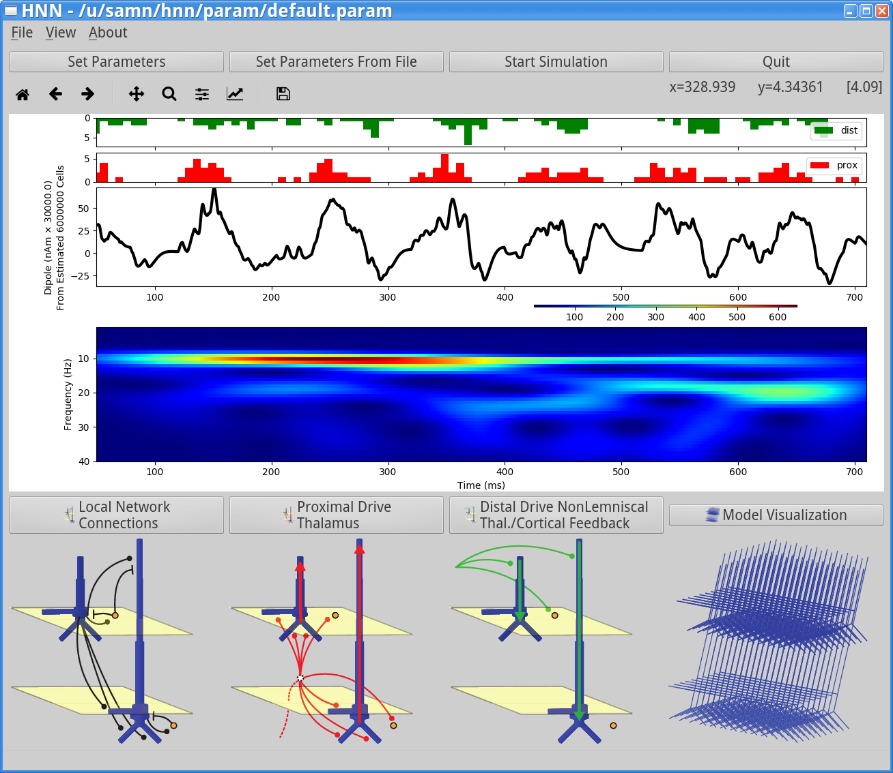
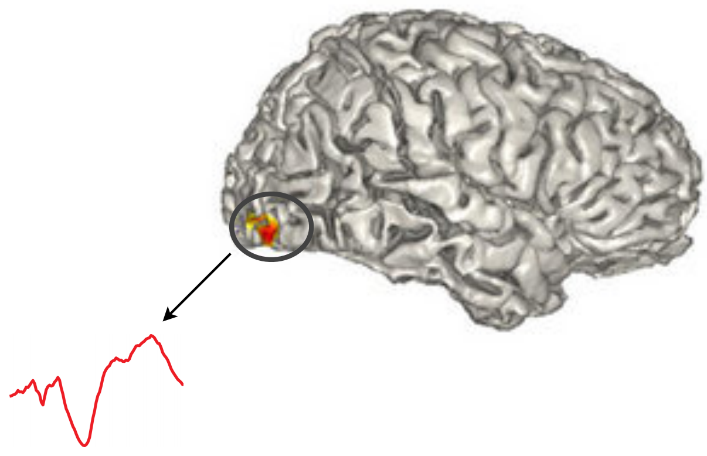

Overview
===============================

What is HNN?
------------

The Human Neocortical Neurosolver (HNN) is a user-friendly software tool that combines top-down
(sensors to electrical current sources) and bottom-up (circuits to electrical current sources)
models of signal interpretation, addressing one of the major challenges in Human Neuroscience:
connecting macroscale human imaging signals (MEG/EEG) to cellular and circuit level
electrophysiology, through linkage with biophysical modeling.

Our goal was to design HNN to be useful to researchers with no formal computational neural
modeling or coding experience who want to develop and test hypotheses on the cellular and circuit
level generators of source localized human data. The software allows for interpretation,
visualization, and manipulation of cellular and circuit level dynamics. HNN presents a convenient
GUI to an anatomically and biophysically detailed model of human thalamocortical brain circuits,
which makes it easier to generate and evaluate hypotheses of the mechanistic origin of signals
measured with MEG/EEG or intracranial ECoG.

Above we show HNN's interface including model output. The output consists of several
panels -- top panel: modeled neuron synaptic input histograms; middle panel: model generated
dipole signal (units are in nAm, and directly comparable to data from MEG experiments); bottom panel:
wavelet-based spectrogram from the current dipole signal showing alpha/beta events. The very bottom of the
GUI shows several model schematics.

HNN's biophysical model
-----------------------

HNN's biophysical neural model is unique in that it goes beyond a mean field representation and
includes the morphology and physiology of neocortical neurons across the cortical layers, and
layer specific synaptic inputs, all of which contribute to the recorded signals. The model includes
biophysics generating the primary electric currents underlying such data, and therefore simulation results
are directly comparable to source localized data (in units of nano-Ampere-meters); this enables precise
tuning of model parameters to match characteristics of recorded signals. The software allows for interpretation,
visualization, and manipulation of cellular and circuit level dynamics. Visualization
plugins, which provide 3D views of model cells and their connectivity, also aid intuition on how
circuit architecture can influence neocortical dynamics. 

.. |modschemefig| image:: images/modscheme.png
        :scale: 20%
	:align: bottom

.. |modcolfig| image:: images/modcol.png
        :scale: 20%
	:align: bottom

+--------------------------------------------------------------------------------------+----------------------------------------------------------------------------------------------+
| |modschemefig|                                                                       | |modcolfig|                                                                                  |
|                                                                                      |                                                                                              |
|  Computational neural model written in `NEURON-Python <http://www.neuron.yale.edu>`_ | Model of cortical column includes 100s to                                                    |
|  simulates the direction and timecourse of the primary                               | 1000s (scalable) of multicompartment pyramidal                                               |
|  electrical currents (Jp) via intracellular electrical                               | neurons and single compartment interneurons                                                  |
|  currents in cortical pyramidal neuron dendrites                                     | `(model source code) <https://senselab.med.yale.edu/ModelDB/showmodel.cshtml?model=151685>`_ |
|  (units: nano-Ampere-meters).                                                        |                                                                                              |
|                                                                                      |                                                                                              |
+--------------------------------------------------------------------------------------+----------------------------------------------------------------------------------------------+

Integration with MNE-Python
---------------------------

We are integrating the circuit-level modeling with the minimum-norm-estimate
(`MNE <http://martinos.org/mne/stable/index.html>`_; minimum-norm-estimate) source
localization software, so researchers can compute MEG/EEG source estimates and test hypotheses on
the circuit origin of their data in one software package. 

	Source estimation using MNE-Python to model the location, direction, and time-course of the primary
	electric currents (Jp).

Integration with NSG
--------------------

We are also building resources for
freely using and expanding the software through the
`Neuroscience Gateway Portal <https://www.nsgportal.org/>`_, and online
documentation and a user forum for interaction between users and developers. 

Conclusions
-----------

Here, we present the construction of our tool and describe its use in studying the circuit-level origin of
some of the most commonly measured MEG/EEG and ECoG signal: event related potentials (ERPs) and
low frequency rhythms (alpha/beta/gamma).

