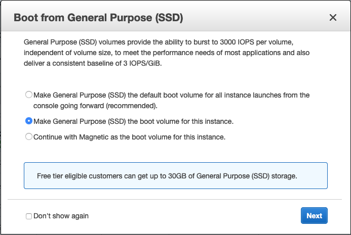

# HNN on Amazon Cloud (AWS)

This guide describes running HNN on Amazon Web Services (AWS). An image containing HNN pre-installed is available as a Community AMI.

## Starting an Amazon EC2 instance with HNN pre-installed

1. First, log into the [AWS Console](https://aws.amazon.com/console/) with your user credentials. Then navigate to "EC2" -> "Launch Instance" or select [Launch a virtual machine](https://us-east-2.console.aws.amazon.com/ec2/v2/home?#LaunchInstanceWizard:).
2. Search for the HNN image "hnn-1.1.2" or the key "ami-0251f4f931bb63795" for us-east-1 Virginia or "ami-0dacc67d076b2c133" for us-east-2 Ohio. Press "Select"
3. Choose an instance type. The image is compatible with "free tier eligible" types. The t2.micro free tier instance will be noticeably slower than a desktop, so if performance is important, choose an instance with more cores. The amount of memory, storage type, and network performance do not have a significant impact. Select "Review and Launch".
4. You will be prompted with a dialog similar to below asking you whether to boot from SSD. This is a good idea and is part of the free tier. It's recommended to select, "Make General Purpose (SSD) the boot volume for this instance." Click "Next.

   

5. Press "Launch" and select your private key for logging into the instance.

## Running HNN on the EC2 instance

1. After the instance state changes to "running", press the "Connect" button. Modify the ssh command given in the dialog box in the two ways below. The command should look something like this:

   ```bash
   ssh -X -i "mykey.pem" ubuntu@ec2-12-100-49-49.us-east-2.compute.amazonaws.com
   ```

    Notes:
    * Use the user `ubuntu`
    * Add `-X` to enable X11 forwarding over ssh (to display the GUI)

2. Type `yes` to continue connecting and add this host to the list of known hosts.
3. Type `hnn` at the prompt and the HNN GUI should show up.

   ```bash
   hnn
   ```

4. You can now proceed to the tutorials at [https://hnn.brown.edu/index.php/tutorials/](https://hnn.brown.edu/index.php/tutorials/). Some things to note:
   * The directory `/home/ubuntu/hnn_out` is where the results from your simulations (data and param files) will be stored.
   * The "Model Visualization" button will not work on the AWS virtualization hardware.

## Building your own AMI

The script used to create the AMI referenced above on Ubuntu 18.04 can be found here: [aws-build.sh](./aws-build.sh). This script can be run in an instance, and then in-turn an image can be created from the instance.

## Troubleshooting

If you run into other issues with the installation, please [open an issue on our GitHub](https://github.com/jonescompneurolab/hnn/issues). Our team monitors these issues and will be able to suggest possible fixes.

For other HNN software issues, please visit the [HNN bulletin board](https://www.neuron.yale.edu/phpBB/viewforum.php?f=46)