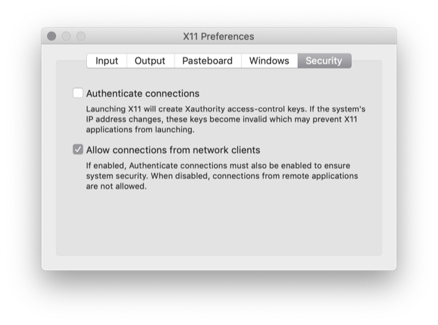

# Installing HNN on Mac OS (Docker install)

This guide describes installing HNN on Mac OS using Docker. This method will automatically download the HNN Docker container image when HNN is started for the first time. If you would prefer to install HNN without Docker, please see the instructions below.
  - Alternative: [Native install instructions (advanced users)](native_install.md)

## Prerequisite: XQuartz
1. Download the installer image (version 2.7.11 tested): https://www.xquartz.org/
2. Run the XQuartz.pkg installer within the image, granting privileges when requested.
3. Start the XQuartz application. An "X" icon will appear in the taskbar along with a terminal, signaling that XQuartz is waiting for connections. You can minimize the terminal, but do not close it.
4. **Important** - Open the XQuartz preferences and navigate to the "security" tab. Make sure "Authenticate connections" is unchecked and "Allow connections from network clients" is checked.

   

## Prerequisite: Docker

Click on your version of Mac OS to expand instructions:

<details><summary>10.12 (Sierra) or above: Docker Desktop</summary>
<p>

1. In order to download Docker Desktop, you'll need to sign up for a Docker Hub account. It only requires an email address to confirm the account. Sign up here: [Docker Hub Sign-up](https://hub.docker.com/signup)
2. Download the installer image (requires logging in to your Docker Hub account):
https://hub.docker.com/editions/community/docker-ce-desktop-mac
3. Run the Docker Desktop installer, moving docker to the applications folder.
4. Start the Docker application, acknowledging that it was downloaded from the Internet and you still want to open it.
5. Log into your Docker Hub account if prompted by the Docker Desktop application.
6. The Docker Desktop icon will appear in the taskbar with the message "Docker Desktop is starting", Followed by "Docker Desktop is running".

</p>
</details>

<details><summary>Pre 10.12: Docker Toolbox</summary>
<p>

1. Download the installer image:
https://docs.docker.com/toolbox/toolbox_install_mac/
2. Run the installer, selecting any directory for installation.
3. Choose "Docker Quickstart Terminal" tool
4. Verify that Docker has started by running the following in the provided terminal window. 
    ```
    docker info
    docker-compose --version
    ```
5. Run the following commands in the same terminal window or by relaunching "Docker Quickstart Terminal".
6. For Docker Toolbox only, we will need to set an IP address in the file docker-compose.yml before starting the HNN container.
    - Get the IP address of the local interface that Docker Toolbox created. It will be named similar to vboxnet1 with an IP address such as 192.168.99.1
      ```
      ifconfig vboxnet1
      ```
    - Edit the docker-compose.yml file in `hnn/installer/mac/`, replacing `host.docker.internal:0` with the IP address such as `192.168.99.1:0` (**The ":0" is required**). Save the file before running the commands below.
</p>
</details>

## Start HNN
1. Verify that XQuartz and Docker are running. These will not start automatically after a reboot. Check that Docker is running properly by typing the following in a new terminal window.
    ```
    docker info
    ```
2. Clone or download the [HNN repo](https://github.com/jonescompneurolab/hnn). If you already have a previous version of the repository, bring it up to date with the command `git pull origin master` instead of the `git clone` command below.
    ```
    git clone https://github.com/jonescompneurolab/hnn.git
    cd hnn/installer/mac
    ```
3. Start the Docker container. Note: the jonescompneurolab/hnn Docker image will be downloaded from Docker Hub (about 1.5 GB). The docker-compose command can be used to manage Docker containers described in the specification file docker-compose.yml. The parameter "up" starts the containers (just one in our case) in that file and "-d" starts the docker container in the background.
    ```
    docker-compose up -d
    ```    
4. The HNN GUI should show up and you should now be able to run the tutorials at https://hnn.brown.edu/index.php/tutorials/ . Some things to note:
   * A directory called "hnn" exists both inside the container (at /home/hnn_user/hnn) and outside (in the directory set by step 2) that can be used to share files between the container and your host OS.
   * If you run into problems starting the Docker container or the GUI is not displaying, please see the [Docker troubleshooting section](../docker/README.md#Troubleshooting)
   * If you closed the HNN GUI or it is no longer running, and you would like to restart it, run the following command from the same directory set in step 2:
      ```
      docker-compose restart
      ```
5. **NOTE:** You may want run commands or edit files within the container. To access a command prompt in the container, use [`docker exec`](https://docs.docker.com/engine/reference/commandline/exec/) as shown below:
    ```
    C:\Users\myuser>docker exec -ti mac_hnn_1 bash
    hnn_user@054ba0c64625:/home/hnn_user$
    ```

    If you'd like to be able to copy files from the host OS without using the shared directory, you do so directly with [`docker cp`](https://docs.docker.com/engine/reference/commandline/cp/).

## Uninstalling HNN

If you want to remove the container and 1.5 GB HNN image, run the following commands from a terminal window. You can then remove Docker Desktop by removing it from your Applications folder.
```
docker rm -f mac_hnn_1
docker rmi jonescompneurolab/hnn
```

# Troubleshooting

For Mac OS specific issues: please see the [Mac OS troubleshooting page](troubleshooting.md)

If you run into other issues with the installation, please [open an issue on our GitHub](https://github.com/jonescompneurolab/hnn/issues). Our team monitors these issues and will be able to suggest possible fixes.

For other HNN software issues, please visit the [HNN bullentin board](https://www.neuron.yale.edu/phpBB/viewforum.php?f=46)