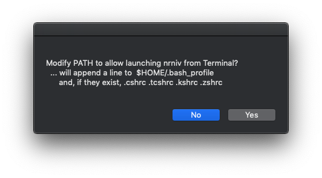
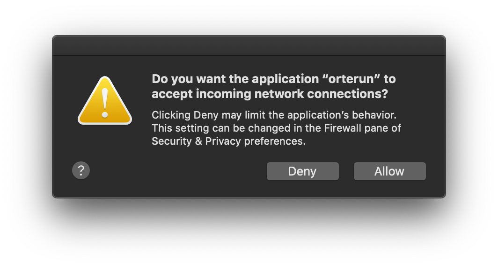

# HNN native install (Mac OS)

This method will run HNN without using virtualization, meaning the GUI may feel more responsive and simulations may run slightly faster. However, the procedure is a set of steps that the user must follow, and there is a possibility that differences in the base environment may require additional troubleshooting. Thus, it is best suited for advanced users. For the recommended Docker-based installation please see the instructions below.

- Alternative: [Docker install instructions](README.md)

## Run pre-install checks

1. The command below will run a script to check for environment variables and python environments that may conflict with these installation instructions. We recommend that you fix the errors before continuing.

    ```bash
    curl -s "https://raw.githubusercontent.com/jonescompneurolab/hnn/master/installer/mac/check-pre.sh" | bash
    ```

## Prerequisite 1: XQuartz

1. Download the installer image (version 2.7.11 tested): https://www.xquartz.org/
2. Open the .dmg image and run XQuartz.pkg within the image, granting privileges when requested.
3. Start the XQuartz.app by searching for XQuartz in Spotlight (upper right search icon). An "X" icon will appear in the taskbar along with a terminal. We will not use this window because it is difficult to copy and paste into it, so you can close it by clicking on the red x in the upper left corner.

   - Alternatively steps 2 and 3 can be run from the terminal app (enter your user password when prompted after the `sudo` command):

     ```bash
     hdiutil attach ~/Downloads/XQuartz-2.7.11.dmg
     sudo installer -pkg /Volumes/XQuartz-2.7.11/XQuartz.pkg -target /
     hdiutil detach /Volumes/XQuartz-2.7.11
     rm ~/Downloads/XQuartz-2.7.11.dmg
     open /Applications/Utilities/XQuartz.app
     ```

## Opening a terminal window

1. Open up macOS's terminal.app by searching for terminal in Spotlight (upper right search icon). We will use this terminal for running the commands below.

## Prerequisite 2: Xcode Command Line Tools

The Xcode Command Line Tools package includes utilities for compiling code from the terminal (gcc, make, etc.). This is needed for compiling mod files in NEURON.

1. To install the package, type the following from a terminal.app window:

    ```bash
    xcode-select --install
    ```

     - If you get the following error, you can skip this step.
      `xcode-select: error: command line tools are already installed, use "Software Update" to install updates`

2. Then select `Install` at the prompt

  

## Prerequisite 3: NEURON

1. Download the NEURON macOS installer from [neuron.yale.edu](https://neuron.yale.edu/neuron/download/precompiled-installers). Then run the .pkg installer.

2. You will be asked about variables in .bashrc, .tcshrc, etc. Say `No`.

  

3. Another window will ask about PYTHONPATH. Say `No`.

  

4. Afterward, you will be presented with a confirmation message that NEURON has been installed. Click `Continue`

  

5. Press `Close` to finish the installation of NEURON

Note: for users wishing to use the command line, the above steps can be accomplished with these commands:

```bash
cd /tmp/
curl -O https://neuron.yale.edu/ftp/neuron/versions/v7.6/nrn-7.6.x86_64-osx.pkg
sudo installer -pkg /tmp/nrn-7.6.x86_64-osx.pkg -allowUntrusted -target /
```

## Prerequisite 4: Miniconda (Python 3)

1. Run the commands below from a terminal window (as a regular user). This will create a python environment isolated from other installations on the system. You could use homebrew `brew install python3` if you wish (has been tested with HNN), but this guide will cover the miniconda version.

    ```bash
    cd /tmp/
    curl -O https://repo.anaconda.com/miniconda/Miniconda3-latest-MacOSX-x86_64.sh
    sh ./Miniconda3-latest-MacOSX-x86_64.sh -b
    rm /tmp/Miniconda3-latest-MacOSX-x86_64.sh
    ```

## Prepare the Python environment

1. Create a conda environment with the Python prerequisites for HNN.

    ```bash
    conda create -y -n hnn python=3.7 openmpi pyqtgraph pyopengl matplotlib scipy psutil
    ```

2. Activate the HNN conda environment and install nlopt

    ```bash
    source activate hnn
    pip install nlopt
    ```

3. Set the LD_LIBRARY_PATH for openmpi on conda activation. This environnment variable must be set before HNN can run simulations with openmpi. The variable is only useful inside the 'hnn' conda environment, so we will set the variable when conda is activated with `source activate hnn`. Run the following commands to make this automatic.

    ```bash
    cd ${CONDA_PREFIX}
    mkdir -p etc/conda/activate.d etc/conda/deactivate.d
    echo "export OLD_LD_LIBRARY_PATH=\$LD_LIBRARY_PATH" >> etc/conda/activate.d/env_vars.sh
    echo "export LD_LIBRARY_PATH=\$LD_LIBRARY_PATH:\${CONDA_PREFIX}/lib" >> etc/conda/activate.d/env_vars.sh
    echo "export LD_LIBRARY_PATH=\$OLD_LD_LIBRARY_PATH" >> etc/conda/deactivate.d/env_vars.sh
    echo "unset OLD_LD_LIBRARY_PATH" >> etc/conda/deactivate.d/env_vars.sh
    ```

4. Set the bash (or other shell) environment variables. Note that depending on your shell (bash or c shell you will use the 4 export commands below or the 4 set commands below, respectively)

  - bash

    Add the following to the end your ~/.bash_profile after all lines referring to conda (e.g. type "open ~/.bash_profile" in the terminal without the quotes to edit it):

    ```bash
    export PYTHONPATH=/Applications/NEURON-7.6/nrn/lib/python:$PYTHONPATH
    export PATH=/Applications/NEURON-7.6/nrn/x86_64/bin:$PATH
    export PATH=$PATH:$HOME/miniconda3/bin/
    ```

  - tcsh

    Add the following in your ~/.cshrc and/or ~/.tcshrc (e.g. type "open ~/.cshrc" or as appropriate in the terminal without the quotes to edit the file):

    ```csh
    set PYTHONPATH=($PYTHONPATH /Applications/NEURON-7.6/nrn/lib/python)
    set path = ($path /Applications/NEURON-7.6/nrn/x86_64/bin)
    set path = ($path $HOME/miniconda3/bin/)
    ```

5. Open a new terminal window for the settings in the previous step to take effect and activate the HNN conda environment

    ```bash
    source activate hnn
    ```

## Clone and compile HNN source code

1. The following commands will clone the source code repository, enter the hnn directory, and compile HNN's mod files for NEURON. This is where Xcode Command Line Tools are needed.:

    ```bash
    git clone https://github.com/jonescompneurolab/hnn.git
    cd hnn
    make
    ```

## Run post-install checks

1. Run the command below from the HNN source code directory to check that all of the steps above have completed as expected. You may proceed if this script fails, but it could aid in troubleshooting starting the HNN GUI.

    ```bash
    installer/mac/check-post.sh
    ```

## Run the HNN model

1. Start the HNN GUI from a terminal window:

    ```bash
    source activate hnn
    python hnn.py
    ```

2. The HNN GUI should show up. Make sure that you can run simulations by clicking the 'Run Simulation' button. This will run a simulation with the default configuration. After it completes, graphs should be displayed in the main window.

3. When you run simulations for the first time, the following dialog boxes may pop-up and ask you for permission to allow connections through the firewall. Saying 'Deny' is fine since simulations will just run locally on your Mac.




4. You can now proceed to running the tutorials at https://hnn.brown.edu/index.php/tutorials/ . Some things to note:
   * A directory called "hnn_out" exists in your home directory where the results from your simulations (data and param files) will be stored.

# Troubleshooting

For Mac OS specific issues: please see the [Mac OS troubleshooting page](troubleshooting.md)

If you run into other issues with the installation, please [open an issue on our GitHub](https://github.com/jonescompneurolab/hnn/issues). Our team monitors these issues and will investigate possible fixes.

For other HNN software issues, please visit the [HNN bulletin board](https://www.neuron.yale.edu/phpBB/viewforum.php?f=46)
