# DEPRECATED: Running HNN on Neuroscience Gateway Portal (NSG)

<span style="color:red">
**HNN GUI is temporality not available on NSG, please email us at hnneurosolver@gmail.com if you have questions about running HNN on NSG**
</span>

The [Neuroscience Gateway Portal (NSG)](http://www.nsgportal.org) is high-performance compute environment sponsored by NSF/NIH and the BBSRC (UK). Availability of HNN on NSG enables users to run simulations on one of many cluster compute nodes, which reduces simulation runtime. In addition, users will not have to install HNN on their local workstations, allowing them to get started running simulations more quickly. Below are instructions on how to run HNN on NSG.

## Getting an account on NSG

1. Create your NSG account [here](https://www.nsgportal.org/gest/reg.php ) if you don't already have one

2. Log in to NSG through a web browser [here](https://nsgdev.sdsc.edu:8443/portal2/login!input.action)

## Preliminary software (VNC, ssh)

You should make sure you have a VNC viewer (e.g. Tightvnc) and `ssh` available from a terminal window. These tools are included by default with Mac/Linux but you may need to install additional software for Windows.

[RealVNC](https://www.realvnc.com/en/connect/download/viewer/) is available on many platforms, but is not open source.

For Ubuntu Linux you can install a vnc viewer using the following command from the terminal:

```bash
sudo apt install xvnc4viewer
```

## Running HNN on NSG

1. You will need to upload some data since NSG jobs require input data. The data can be a zip file with arbitrary content. To do so, click on **New Folder** on the front page, and enter a **Label**. Next, click on **Data**, underneath the new folder on the left hand side, then **Upload/Enter Data** to upload an arbitrary file with an arbitrary **Label**.

2. Click on Toolkit on the top menu:

   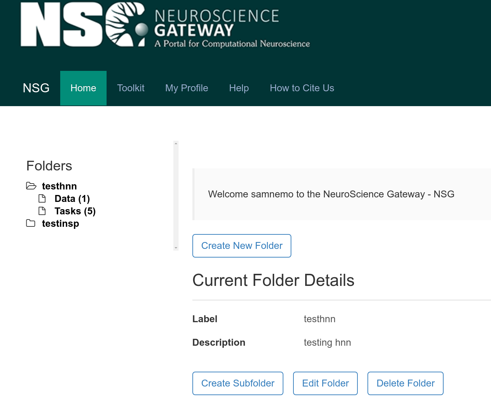

   This will take you to a list of computational neuroscience tools available on NSG:

   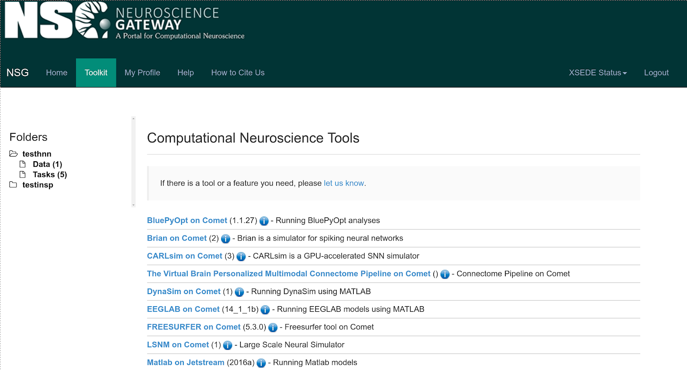

3. Click on **VNC on Jetstream** at the bottom of the list:

   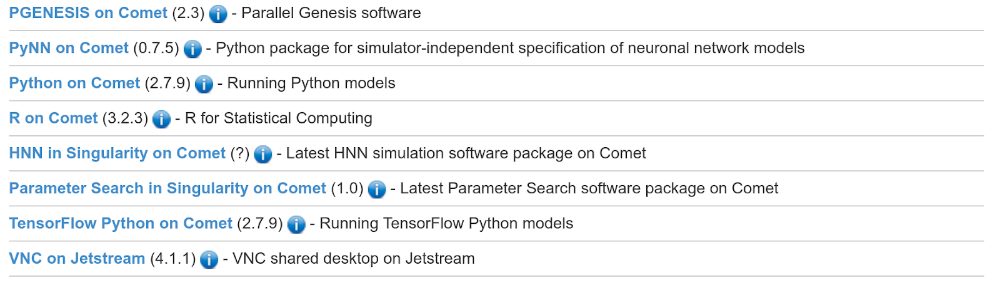

   This will create a new "task" that can allow you to access a desktop on the Jetstream supercomputer through VNC:

   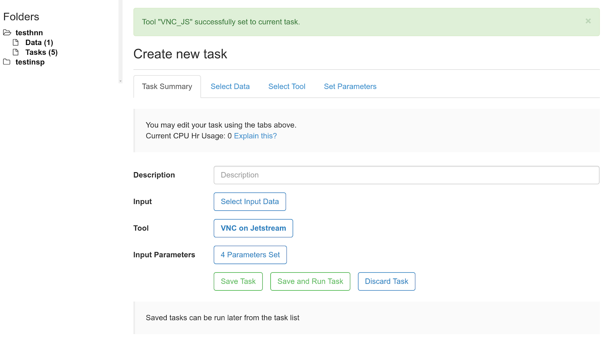

4. If you want to customize how much time you have to run HNN once your VNC job is created, you can click on **Set Parameters** and then enter the **Maximum Hours to Run** (0.5 is the default).

5. Enter a **Description** for your task in the text field next to **Description**. For example, you could write "HNN simulation".

6. Click on **Select Data** then pick the zip file you uploaded in step 3.

7. Click **Save Task**. This will take you to a list of available tasks to run:

   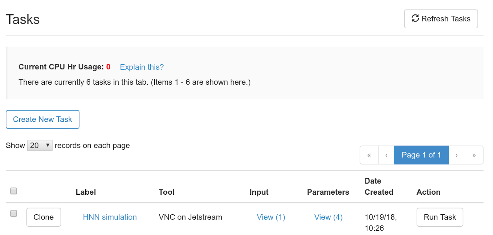

8. Click **Run Task** for the task you created to start the job. Click **OK** on the resulting dialogue box.

9. Click on **View Status** to see how the job is progressing and to get the information needed to login to NSG using VNC.

    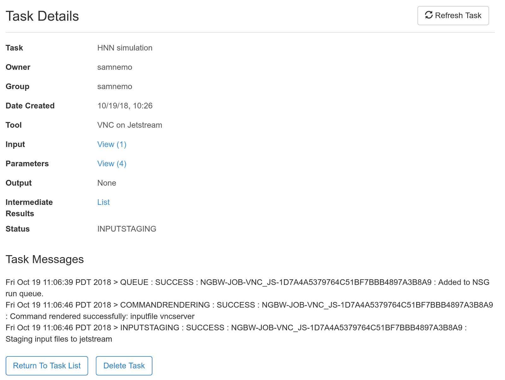

10. After a few minutes (or longer, depending on others' use of NSG) you will receive an email from [](nsguser@jetstream-cloud.org) stating that your VNC session is ready, and including instructions for how to login to your VNC session, which are as follows, but are explained in more detail below:

    1. On your local machine, start an ssh tunnel from your local port 5902 to the vnc server node port 5901. Use the password in **Intermediate Results**: `ssh.password`

       ```bash
       ssh -l nsguser -L 5902:localhost:5901 149.165.157.55
       ```

    2. Use a VNC client from [above](./README.md#preliminary-software-vnc-ssh)

    3. Then start then vnc viewer to `localhost:2`
      Use the password in **Intermediate Results**: `vnc.password`

       To examine or retrieve files on the VNC node, ssh or scp may be used:

       ```bash
       ssh -l nsguser 149.165.157.55
       ```

       For the hnn data directory:

       ```bash
       scp -pr 'nsguser@149.165.157.55:~/hnn/data/*' mydownloaddir
       ```

       or for the entire job directory:

       ```bash
       scp -pr 'nsguser@149.165.157.55:~' mydownloaddir
       ```

11. Click on the **List** link next to **Intermediate Results**. This will bring up a window listing files after a few minutes that contains a link to `vnc.password` and `ssh.password`:

    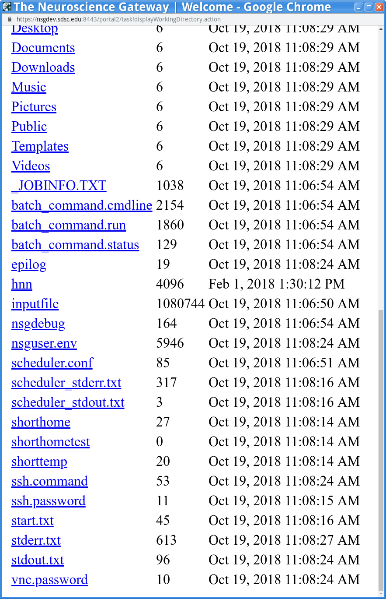

    You should download both of these files to your computer.

12. Start a terminal.

13. Enter the following command in the terminal:

    ```bash
    ssh -l nsguser -L 5902:localhost:5901 149.165.157.55
    ```

    When prompted for a password, use the text inside of the `ssh.password` file you downloaded in step 11. In order to see the text inside of the `ssh.password` file, enter the following command from the directory where you have stored the file (in a separate terminal):

    ```bash
    more ssh.password
    ```

14. Enter the following command in a separate terminal:

    ```bash
    vncviewer localhost:2
    ```

    If this does not work, you may have to switch to the VNC Viewer folder before running the vncviewer command. For example, on the Windows operating system, you would first type:

    ```
    cd C:\Program Files\RealVNC\VNC Viewer
    ```

    When prompted for a password use the text inside the vnc.password file you downloaded in step 11. (Note that the vncviewer command depends on which VNC software you have installed on your computer). This will open a VNC viewer display of your NSG desktop:

    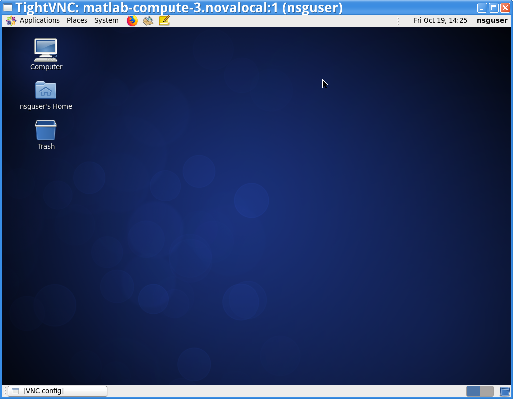

15. In the VNC viewer window Click on **Applications** -> **System tools** -> **Terminal**

    This will start a command line terminal as shown here:

    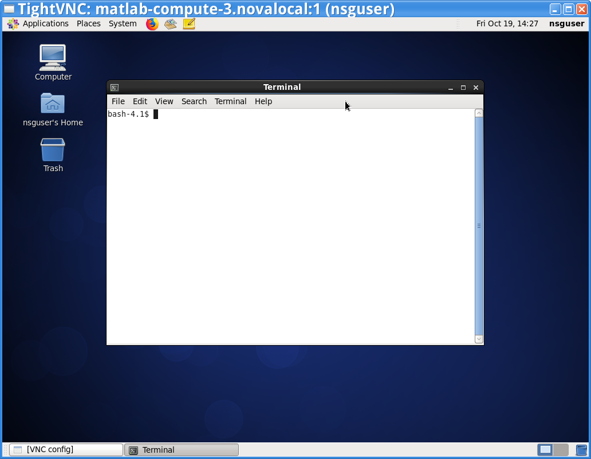

16. In the terminal, enter the following command:

    ```bash
    hnn
    ```

    This will start the HNN graphical user interface as shown here:

    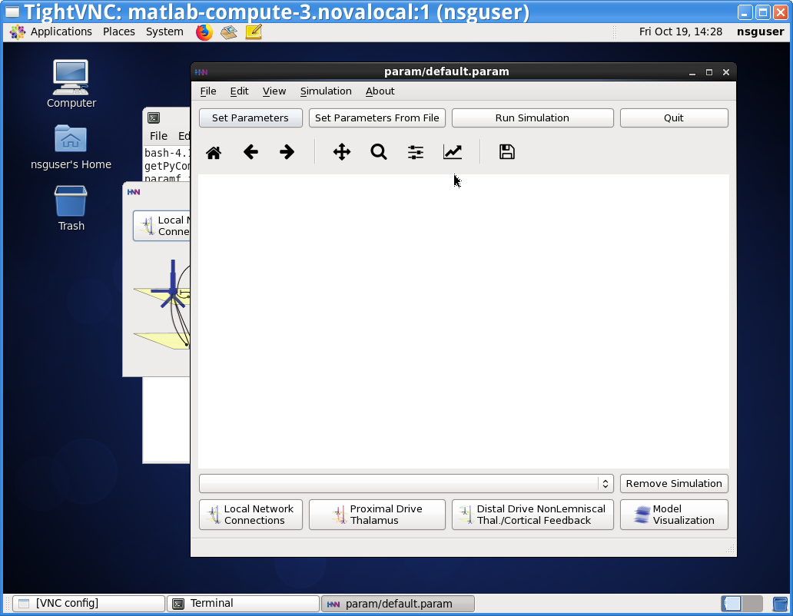

17. Use HNN to Run simulations by clicking on **Run Simulation**. If asked whether to overwrite a file, click **OK**. After that, HNN will run its default ERP simulation, producing the output shown here:

    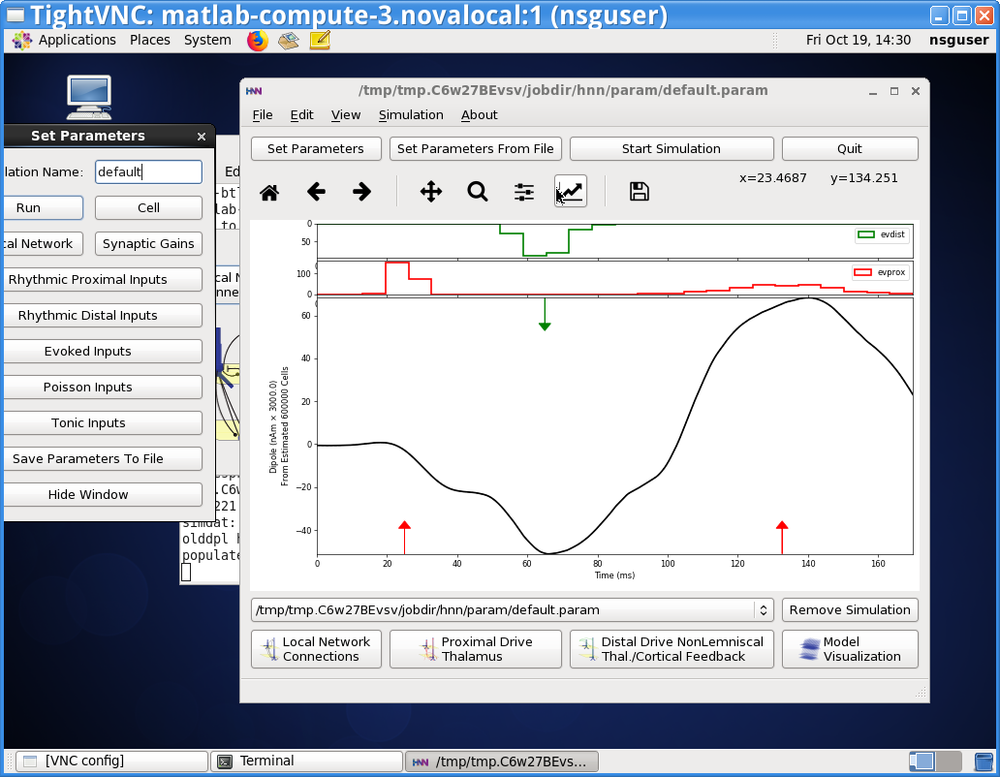

    You can now continue to run other simulations, as desired. For more information on how to use HNN to run simulations and compare model to experimental data, see our [Tutorials](https://hnn.brown.edu/index.php/tutorials/)

18. When you are done running simulations, log out of the VNC viewer by clicking first on the **nsguser** menu in the top right corner, and then on **Quit**, as shown here:

    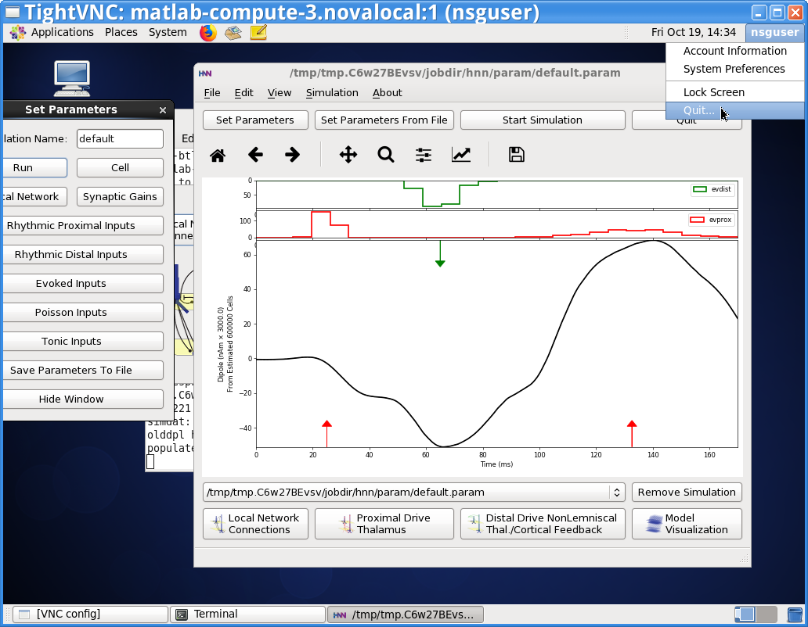

    When prompted click on **Log out**. NSG will then create an output file that you can download.

19. You can download the data using either `scp` (19.1) or NSG's web browser interface (19.2).

    1. To use `scp` for the hnn data directory enter the following in the terminal:

       ```bash
       scp -pr 'nsguser@149.165.157.55:~/hnn/data/*' mydownloaddir
       ```

       or for the entire job directory:

       ```bash
       scp -pr 'nsguser@149.165.157.55:~' mydownloaddir
       ```

       When prompted for a password, use the text in the `ssh.password` you downloaded in step 11. Note that `mydownloaddir` is a local directory on your computer that you want to download the data to.

    2. Refresh the task list in the web browser. Then click on output. After a few minutes you will see a file `output.tar.gz` in the list, which contains the output data from the simulations you ran. After downloading it, you can extract its contents using the following command from the terminal:

       ```bash
       tar -xvf output.tar.gz
       ```

       This will extract the data into a new directory. You can browse the output in the data subdirectory, and it will contain one subdirectory for each simulation run. See the HNN website for more information on the content of these files.

## Troubleshooting

For HNN software issues, please visit the [HNN bulletin board](https://www.neuron.yale.edu/phpBB/viewforum.php?f=46)
