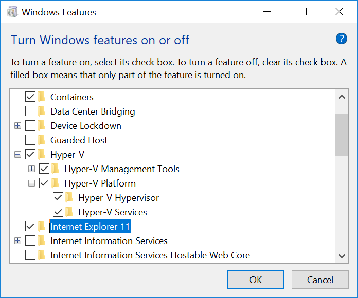

# Installing HNN on Windows 10 Pro (Docker Desktop)

## Prerequisite: Virtualization support

There are two related requirements needed for Docker to be able to run HNN in a virtual machine on your Windows system

1. Hardware virtualization features (manual setting)

    If not already enabled, it may be necessary to manually set these through your PC manufacturer's BIOS settings. Only old systems do not support this feature. However, if Docker cannot turn this feature on from its installer, you may need to reboot your computer and change your PC manufacturer's BIOS settings. You can check whether it is enabled from the Task Manger. The picture below shows that hardware virtualization is disabled and will need to be manually enabled in the BIOS.

    

    See [https://www.trishtech.com/2017/08/check-if-virtualization-is-enabled-in-windows-10](https://www.trishtech.com/2017/08/check-if-virtualization-is-enabled-in-windows-10) for more details.

    If you run into problems enabling hardware virtualization support, we recommend that you follow the [native install instructions](native_install.md) instead. Also running our [VirtualBox VM with HNN pre-installed](https://hnn.brown.edu/index.php/installation-instructions/) is possible without hardware virtualization support.

2. Hyper-V support (will be enabled during Docker Desktop install below)

   While it is necessary to turn on Hyper-V for using HNN with Docker Desktop, you should be aware that it will not allow you to also run virtual machines through applications such as VirtualBox. We recommend that you let Docker automatically attempt to turn this feature on during installation. Alternatively, the procedure below allows you to verify that it is turned on and enable it if necessary.

   1. Start typing "Turn Windows features on or off" in the search bar next to start menu and click on it to launch the control panel dialog window shown below.
   2. Make sure that "Hyper-V" and "Hyper-V Platform" is turned on as shown in the image below

      

   3. **If you enabled Hyper-V, please reboot your computer before continuing below to install docker.**

## Prerequisite: VcXsrv

1. Download the installer from [https://sourceforge.net/projects/vcxsrv/files/latest/download](https://sourceforge.net/projects/vcxsrv/files/latest/download) (click [here](https://downloads.sourceforge.net/project/vcxsrv/vcxsrv/1.20.1.4/vcxsrv-64.1.20.1.4.installer.exe?r=https%3A%2F%2Fsourceforge.net%2Fprojects%2Fvcxsrv%2Ffiles%2Fvcxsrv%2F1.20.1.4%2Fvcxsrv-64.1.20.1.4.installer.exe%2Fdownload%3Fuse_mirror%3Dversaweb%26r%3Dhttps%253A%252F%252Fsourceforge.net%252Fprojects%252Fvcxsrv%252Ffiles%252Flatest%252Fdownload&ts=1550243133) for the direct download link for version 64.1.20.1.4)
2. Run the installer, choosing "C:\Program Files\VcXsrv" as the destination folder. If you choose a different folder the `hnn_docker.sh` script will not be able to launch it automatically. You can start it manually using the procedure below:
    * (optional) starting VcXsrv manually:
        1. Start the XLaunch desktop app from the VcXsrv folder in the start menu.
        2. Choose "Multiple windows" and click 'Next'.
        3. Select "Start no client" and click 'Next'.
        4. **Make sure that "Disable access control" is checked under "Extra settings".** Click 'Next'.
        5. Click "Save configuration" to create a shortcut with the settings we just chose. Click "Finish" and an "X" icon will appear in the lower-right dock signaling that VcXsrv has started.
        6. A message from Windows firewall to allow connections may pop up. If it does, choose options allowing connections to the VcXsrv when connected to both public and private networks.

## Prerequisite: Docker Desktop

1. In order to download Docker Desktop, you'll need to sign up for a Docker Hub account. It only requires an email address to confirm the account. Sign up here: [Docker Hub Sign-up](https://hub.docker.com/signup)
2. Download the installer (requires logging in to your Docker Hub account): [Docker Desktop](https://hub.docker.com/editions/community/docker-ce-desktop-windows)
3. Run the installer. **DO NOT check** "Use Windows containers instead of Linux containers".
4. Start the Docker Desktop app from the start menu or desktop (requires logging in to your Docker Hub account). This takes about 30 seconds and the Docker icon will appear in the lower-right dock
5. When Docker Desktop is initializing, it may prompt you to turn on Hyper-V.
   * If you get a message similar to the screen below, click 'Ok' and restart your computer.

     

6. Docker Desktop will start after the install has completed and the Docker icon will show up in the lower-right dock with a message "Docker Desktop is running"
   * If you get the error message shown below, there was a problem turning on hardware support for virtualization, which is required for Docker on Windows. This may be fixable by changing settings in your PC manufacturer's BIOS. See the note on "Hardware virtualization features" under the "Prerequisite: Virtualization support" heading at the top of this page.

     

7. Reboot your computer after installing Docker

## Prerequisite: Git for Windows

1. Download [Git for Windows](https://gitforwindows.org/)
2. Run the installer, choosing default options

## Start HNN

1. Verify that Docker is running. The Docker Desktop icon should be present in the lower-right dock.

2. Clone the [HNN repo](https://github.com/jonescompneurolab/hnn). Start a 'Git Bash' window from the Start Menu and type the following commands in that window. If you already have a previous version of the repository, bring it up to date with the command `git pull origin master` instead of the `git clone` command below.

    ```bash
    git clone https://github.com/jonescompneurolab/hnn.git
    cd hnn
    ```

3. Start the Docker container using the `hnn_docker.sh` script. For the first time, we will pass the `-u` option in case there were any previous versions of the docker image on your computer. You can omit the `-u` option later

    ```bash
    ./hnn_docker.sh -u start
    ```

    * If a prompt appears from the lower-right and ask you to share the drive, click 'Share'. If you miss this on the first time, the script will hang on "Starting HNN..." and eventually fail. Rerun the script to see the prompt again.
    * A window will pop up stating "Docker needs to access your computer's filesystem". This is necessary to share data and parameter files that HNN creates with your Windows OS. Enter your Windows login password.

        

4. The HNN GUI should show up. Make sure that you can run simulations by clicking the 'Run Simulation' button. This will run a simulation with the default configuration. After it completes, graphs should be displayed in the main window.
    * If the GUI doesn't show up, check the [Docker troubleshooting section](../docker/troubleshooting.md) (also links the bottom of this page)
5. You can now proceed to running the tutorials at [https://hnn.brown.edu/index.php/tutorials/](https://hnn.brown.edu/index.php/tutorials/) . Some things to note:
   * A directory called "hnn_out" exists both inside the container (at /home/hnn_user/hnn_out) and outside (in the directory set by step 2) that can be used to share files between the container and your host OS.
   * The HNN repository with sample data and parameter files exists at /home/hnn_user/hnn_source_code
6. To quit HNN and shut down container, first press 'Quit' within the GUI. Then run `./hnn_docker.sh stop`.

    ```bash
    ./hnn_docker.sh stop
    ```

## Upgrading to a new version of HNN

To pull the latest docker image from Docker Hub, run the `./hnn_docker.sh` script. After the image has been downloaded, the GUI will be the latest version.

```bash
./hnn_docker.sh -u start
```

## Editing files within HNN container

You may want run commands or edit files within the container. To access a command shell in the container, start the container using `./hnn_docker.sh  start` to start hnn in the background and use [`docker exec`](https://docs.docker.com/engine/reference/commandline/exec/) as shown below:

```none
$ winpty docker exec -ti hnn_container bash
hnn_user@hnn-container:/home/hnn_user/hnn_source_code$
```

If you'd like to be able to copy files from the host OS without using the shared directory, you can do so directly with [`docker cp`](https://docs.docker.com/engine/reference/commandline/cp/).

## Uninstalling HNN

If you want to remove the container and 1.6 GB HNN image, run the following commands from a terminal window.

```bash
./hnn_docker.sh uninstall
```

You can then remove Docker Desktop from "Uninstall a program" in the Control Panel.

## Troubleshooting

For errors related to Docker, please see the [Docker troubleshooting section](../docker/troubleshooting.md)

If you run into other issues with the installation, please [open an issue on our GitHub](https://github.com/jonescompneurolab/hnn/issues). Our team monitors these issues and will be able to suggest possible fixes.

For other HNN software issues, please visit the [HNN bulletin board](https://www.neuron.yale.edu/phpBB/viewforum.php?f=46)
