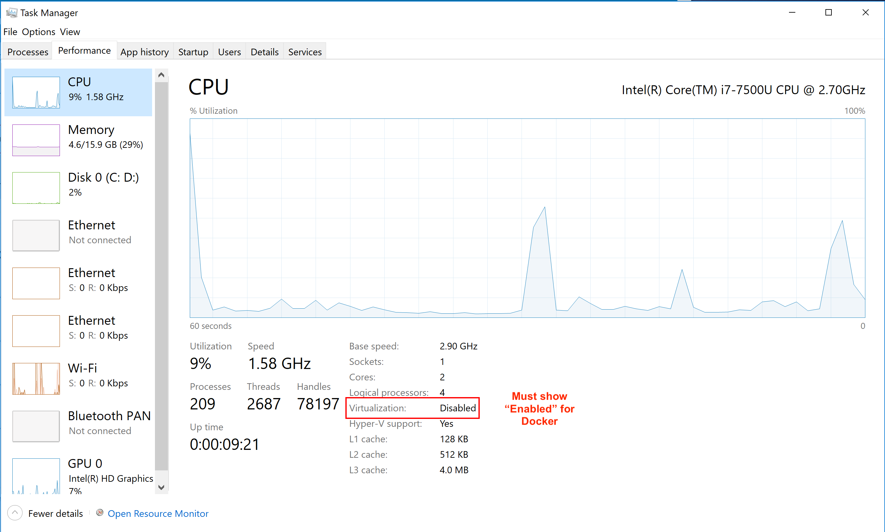

# Installing HNN on Windows 10 (Home)

## Prerequisite: hardware virtualization features

Nearly all PC's have this feature, but it may not be enabled by default. If not already enabled, it may be necessary to manually set these through your PC manufacturer's BIOS settings. However, if Docker cannot turn this feature on from its installer, you may need to reboot your computer and change your PC manufacturer's BIOS settings. You can check whether it is enabled from the Task Manger. The picture below shows that hardware virtualization is disabled and will need to be manually enabled in the BIOS.

  

See [https://www.trishtech.com/2017/08/check-if-virtualization-is-enabled-in-windows-10](https://www.trishtech.com/2017/08/check-if-virtualization-is-enabled-in-windows-10) for more details.

If you run into problems enabling hardware virtualization support, we recommend that you follow the [native install instructions](native_install.md) instead. Also running our [VirtualBox VM with HNN pre-installed](https://hnn.brown.edu/index.php/installation-instructions/) is possible without hardware virtualization support.

## Prerequisite: disable Hyper-V

It is necessary to turn off Hyper-V for using HNN with Docker Toolbox. You may find that this feature is already turned off, but use the following steps to confirm.

1. Start typing "Turn Windows features on or off" in the search bar next to start menu and click on it to launch the control panel dialog window shown below.
2. Make sure that both components, "Hyper-V" and "Containers" are unchecked and click "Ok".

    

3. **If you disabled Hyper-V, please reboot your computer before continuing below to install docker.**

## Prerequisite: VcXsrv (XLaunch)

1. Download the installer from [https://sourceforge.net/projects/vcxsrv/files/latest/download](https://sourceforge.net/projects/vcxsrv/files/latest/download)
   * Here's the link to the [direct download of version 64.1.20.1.4](https://downloads.sourceforge.net/project/vcxsrv/vcxsrv/1.20.1.4/vcxsrv-64.1.20.1.4.installer.exe?r=https%3A%2F%2Fsourceforge.net%2Fprojects%2Fvcxsrv%2Ffiles%2Fvcxsrv%2F1.20.1.4%2Fvcxsrv-64.1.20.1.4.installer.exe%2Fdownload%3Fuse_mirror%3Dversaweb%26r%3Dhttps%253A%252F%252Fsourceforge.net%252Fprojects%252Fvcxsrv%252Ffiles%252Flatest%252Fdownload&ts=1550243133)
2. Run the installer, choosing "C:\Program Files\VcXsrv" as the destination folder. If you choose a different folder the `hnn_docker.sh` script will not be able to launch it automatically.

## Prerequisite: Docker Toolbox

1. Download the latest installer image (.exe): [https://github.com/docker/toolbox/releases/](https://github.com/docker/toolbox/releases/)
2. Run the installer. Click 'Yes' if there's a Windows security prompt requesting to make changes to your device.
3. Choose any install location.
4. In "Select Components" check the components "Docker Compose for Windows" and "VirtualBox" **and "Git for Windows"**. "Kitematic" is not needed. Click 'Next'.
5. In "Select Additional Tasks", make sure to **check "Add docker binaries to PATH"**. Click 'Next'.
6. Choose the default for the other options and click 'Install'.
7. When the installer has finished, select the option to "Open program shortcuts in File Explorer". Click "Finish".
8. Click on the "Docker Quickstart Terminal" shortcut. After opening the window, docker will run "pre-create checks" and then install VirtualBox (if needed). The output should be similar to below. Keep this window opening for running commands in later steps

    ```none
    Creating CA: C:\Users\caldw\.docker\machine\certs\ca.pem
    Creating client certificate: C:\Users\caldw\.docker\machine\certs\cert.pem
    Running pre-create checks...
    (default) Unable to get the latest Boot2Docker ISO release version:  Get https://api.github.com/repos/boot2docker/boot2docker/releases/latest: dial tcp: lookup api.github.com: no such host
    Creating machine...
    (default) Unable to get the latest Boot2Docker ISO release version:  Get https://api.github.com/repos/boot2docker/boot2docker/releases/latest: dial tcp: lookup api.github.com: no such host
    (default) Copying C:\Users\user\.docker\machine\cache\boot2docker.iso to C:\Users\user\.docker\machine\machines\default\boot2docker.iso...
    (default) Creating VirtualBox VM...
    (default) Creating SSH key...
    (default) Starting the VM...
    (default) Check network to re-create if needed...
    (default) Windows might ask for the permission to create a network adapter. Sometimes, such confirmation window is minimized in the taskbar.
    (default) Found a new host-only adapter: "VirtualBox Host-Only Ethernet Adapter #12"
    (default) Windows might ask for the permission to configure a network adapter. Sometimes, such confirmation window is minimized in the taskbar.
    (default) Windows might ask for the permission to configure a dhcp server. Sometimes, such confirmation window is minimized in the taskbar.
    (default) Waiting for an IP...
    Waiting for machine to be running, this may take a few minutes...
    Detecting operating system of created instance...
    Waiting for SSH to be available...
    Detecting the provisioner...
    Provisioning with boot2docker...
    Copying certs to the local machine directory...
    Copying certs to the remote machine...
    Setting Docker configuration on the remote daemon...
    Checking connection to Docker...
    Docker is up and running!
    To see how to connect your Docker Client to the Docker Engine running on this virtual machine, run: C:\Program Files\Docker Toolbox\docker-machine.exe env default


                            ##         .
                    ## ## ##        ==
                ## ## ## ## ##    ===
            /"""""""""""""""""\___/ ===
        ~~~ {~~ ~~~~ ~~~ ~~~~ ~~~ ~ /  ===- ~~~
            \______ o           __/
                \    \         __/
                \____\_______/

    docker is configured to use the default machine with IP 192.168.99.100
    For help getting started, check out the docs at https://docs.docker.com


    Start interactive shell
    user@DESKTOP-LHCRPOM /c/Program Files/Docker Toolbox$
    ```

   * If you get the error message shown below in the "Docker Quickstart Terminal", hardware support for virtualization isn't turned on, which is required for Docker on Windows. This may be fixable by changing settings in your PC manufacturer's BIOS. See the note on "Hardware virtualization features" under the "Prerequisite: Virtualization support" heading at the top of this page.

      

   * If you get the error message shown below, the Hyper-V feature needs to be turned off. Please see the "Prerequisite: disable Hyper-V" heading at the top of this page. After rebooting, launch "Docker Quickstart Terminal" from the Start Menu.

      

9. We want HNN to use all of the CPU cores available on your system when it runs a simulation, and Docker only uses half by default. To change this setting we need to first stop the Docker VM that was started above in step 5. Run the command below in a "Docker Quickstart Terminal" window.

    ```bash
    $ docker-machine stop
    ```

10. Type 'VirtualBox' into the start menu search bar and launch "Oracle VM VirtualBox"
11. Click on the VM "default" in the left pane and then click "Settings"
12. Navigate to "System", then the "Processor" tab and move the slider all the way to the right.

    

13. Click 'Ok', then reopen "Docker Quickstart Terminal". When you get the prompt after "Start interactive shell", you can continue on.

If you run into problems, check the official Docker Toolbox documentation: [Docker Toolbox for Windows](https://docs.docker.com/toolbox/toolbox_install_windows/)

## Start HNN

1. From a "Docker Quickstart Terminal", clone the [HNN repo](https://github.com/jonescompneurolab/hnn). If you already have a previous version of the repository, bring it up to date with the command `git pull origin master` instead of the `git clone` command below.

    ```bash
    cd ~
    git clone https://github.com/jonescompneurolab/hnn.git
    cd hnn
    ```

2. Start the Docker container using the `hnn_docker.sh` script. For the first time, we will pass the `-u` option in case there were any previous versions of the docker image on your computer. You can omit the `-u` option later

    ```bash
    ./hnn_docker.sh -u start
    ```

    * A window may pop up stating "Docker needs to access your computer's filesystem". This is necessary to share data and parameter files that HNN creates with your Windows OS. Enter your Windows login password.

        

3. The HNN GUI should show up. Make sure that you can run simulations by clicking the 'Run Simulation' button. This will run a simulation with the default configuration. After it completes, graphs should be displayed in the main window.
    * If the GUI doesn't show up, check the [Docker troubleshooting section](../docker/troubleshooting.md) (also links the bottom of this page)
4. You can now proceed to running the tutorials at [https://hnn.brown.edu/index.php/tutorials/](https://hnn.brown.edu/index.php/tutorials/) . Some things to note:
    * A subdirectory called "hnn_out" is created in your home directory and is where simulation results and parameter files will be saved.
5. To quit HNN and shut down container, first press 'Quit' within the GUI. Then run `./hnn_docker.sh stop`.

    ```bash
    ./hnn_docker.sh stop
    ```

## Stopping Docker Toolbox VM

The Docker Toolbox VM will remain running the background using some resources. If you are not using HNN, you can shut down the VM by the following command:

```bash
docker-machine stop
```

## Upgrading to a new version of HNN

To just pull the latest docker image from Docker Hub:

```bash
./hnn_docker.sh upgrade
```

Instead to upgrade and start the newest GUI:

```bash
./hnn_docker.sh -u start
```

## Editing files within HNN container

You may want run commands or edit files within the container. To access a command shell in the container, start the container using `./hnn_docker.sh  start` in one terminal window to start hnn in the background and then run [`docker exec`](https://docs.docker.com/engine/reference/commandline/exec/) in another terminal window:

```none
$ winpty docker exec -ti hnn_container bash
hnn_user@hnn-container:/home/hnn_user/hnn_source_code$
```

If you'd like to be able to copy files from the host OS without using the shared directory, you can do so directly with [`docker cp`](https://docs.docker.com/engine/reference/commandline/cp/).

## Uninstalling HNN

1. If you want to remove the container and 1.6 GB HNN image, run the following commands from a terminal window.

    ```bash
    ./hnn_docker.sh uninstall
    ```

2. You can then remove Docker Toolbox from "Uninstall a program" in the Control Panel.

3. You can remove Virtualbox as well if you no longer need it to run virtual machines

## Troubleshooting

For errors related to Docker, please see the [Docker troubleshooting section](../docker/troubleshooting.md)

If you run into other issues with the installation, please [open an issue on our GitHub](https://github.com/jonescompneurolab/hnn/issues). Our team monitors these issues and will be able to suggest possible fixes.

For other HNN software issues, please visit the [HNN bulletin board](https://www.neuron.yale.edu/phpBB/viewforum.php?f=46)
